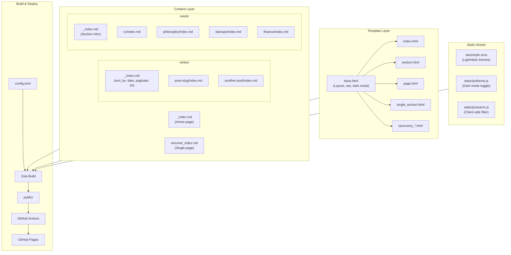
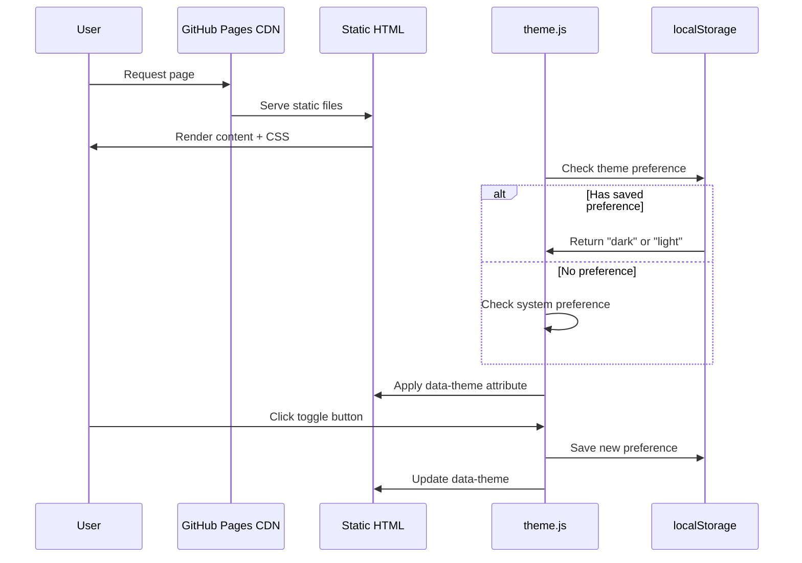
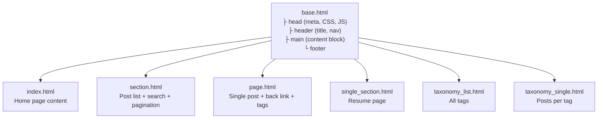

# HARSH PRATAP SINGH

Personal blog built with [Zola](https://www.getzola.org/) - a fast static site generator written in Rust.

**Live at:** https://harsh-ps-2003.github.io

## Architecture



## Data Flow



## Template Inheritance



## Local Development

```bash
# Install Zola (macOS)
brew install zola

# Install Node dependencies (for diagram export)
pnpm install

# Run dev server with live reload
zola serve

# Build for production
zola build
```

## Diagrams with Excalidraw

This blog supports Excalidraw diagrams for system design and architecture illustrations.

### Creating Diagrams

**Method 1: Using Excalidraw MCP (Recommended)**

With the Excalidraw MCP server, you can create diagrams directly from Cursor:

```
# Create a diagram using MCP tools
1. Use batch_create_elements to create shapes and arrows
2. Use export_scene to save as .excalidraw file
3. Use export_to_image to export as SVG
```

**Method 2: Manual Export**

```bash
# Export a single diagram to SVG
pnpm exec excalidraw-export content/writes/my-post/diagram.excalidraw --svg

# Export all diagrams in the project
pnpm run diagram:export
```

### Diagram Workflow

1. **Create**: Use Excalidraw MCP or the VS Code extension to create `.excalidraw` files
2. **Save**: Place `.excalidraw` files next to your blog post or in `static/diagrams/`
3. **Export**: Run `pnpm run diagram:export` to convert all to SVG
4. **Use**: Reference in markdown: ``

### File Locations

- **Post-specific diagrams**: `content/writes/my-post/diagram.excalidraw` → `diagram.svg`
- **Shared diagrams**: `static/diagrams/architecture.excalidraw` → `architecture.svg`

### Scripts

| Command | Description |
|---------|-------------|
| `pnpm run diagram:export` | Export all `.excalidraw` files to SVG |
| `pnpm run diagram:svg <file>` | Export single file to SVG |
| `pnpm run diagram:png <file>` | Export single file to PNG (2x scale) |

## Adding Content

### New Blog Post

```bash
mkdir content/writes/my-new-post
```

Create `content/writes/my-new-post/index.md`:

```toml
+++
title = "My Post Title"
date = 2026-07-28
[taxonomies]
tags = ["ai", "systems"]
+++

Your content here...

  # colocated image
```

### New Reading List Entry

Add to existing category in `content/reads/cs/index.md`, `content/reads/philosophy/index.md`, etc.

### New Navigation Section

1. Create `content/new-section/_index.md`
2. Add to `config.toml`:
   ```toml
   main_menu = [
       { name = "home", url = "/" },
       { name = "writes", url = "/writes/" },
       { name = "reads", url = "/reads/" },
       { name = "resume", url = "/resume/" },
       { name = "new-section", url = "/new-section/" },
   ]
   ```

## File Structure

```
harsh-ps-2003/
├── config.toml              # Site configuration
├── content/
│   ├── _index.md            # Home page
│   ├── writes/
│   │   ├── _index.md        # Section config
│   │   └── */index.md       # Blog posts (24 posts)
│   ├── reads/
│   │   ├── _index.md        # Section intro
│   │   ├── cs/index.md
│   │   ├── philosophy/index.md
│   │   ├── startups/index.md
│   │   └── finance/index.md
│   └── resume/_index.md     # Resume page
├── templates/
│   ├── base.html
│   ├── index.html
│   ├── section.html
│   ├── page.html
│   ├── single_section.html
│   ├── taxonomy_list.html
│   └── taxonomy_single.html
├── sass/style.scss
├── static/js/
│   ├── theme.js
│   └── search.js
└── .github/workflows/deploy.yml
```

## Features

| Feature | Implementation |
|---------|---------------|
| Dark mode | CSS custom properties + `[data-theme]` + localStorage |
| Search | Client-side filtering with debounced input |
| Tags | Zola taxonomies with dedicated pages |
| Pagination | 20 posts per page on writes section |
| Performance | Static HTML, no frameworks, ~5KB CSS |
| SEO | Meta descriptions, sitemap.xml, robots.txt |

## Deployment

Push to `main` branch → GitHub Actions builds → Deploys to GitHub Pages

> **Note:** Repository must be named `harsh-ps-2003.github.io` for the site to be served at the root URL.
