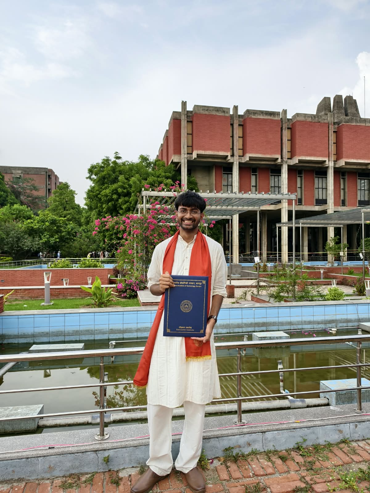

+++
title = "education"
template = "single_section.html"
in_search_index = false
+++

## Education

*Masters of Science* in *Computer Science* with specialization in Machine Learning from **Georgia Institute of Technology**
> (Thesis under [Prof. Felix J. Herrmann in SLIM](tab:https://slim.gatech.edu/people/team))

*Bachelors of Science* in *Earth Sciences* (major), *Computer Science* (minor) and *Philosophy* (minor) at **Indian Institute of Technology, Kanpur**
> (Thesis under [Prof Dibakar Ghosal](tab:https://home.iitk.ac.in/~dghosal/Home.html) and [Prof Subhojit Roy](tab:https://www.cse.iitk.ac.in/users/subhajit/))

During my undergrad years, I had a very curiosity-driven approach to STEM and I fundamentally pursued Computational Sciences with some Philosophy. I enjoyed inter-disciplinary research quite a lot! Got my bachelors thesis published as well ([Matching the wavefield is not matching the CPML solver](tab:/education/neurIPS_ai4science.pdf)) in [NeurIPS AI for Science Workshop](tab:https://ai4sciencecommunity.github.io/neurips26.html).

Undergrad was very special time of my life! I cherish my alma-mater way beyond the courses I took there, literally did all the hard cool courses I could find in STEM! I spent my time there figuring out what I actually wanted to do with my life! It was the first time in my life that I had some individual freedom and autonomy. I couldn't care less about studies (fuked up my GPA). Did some solo tripping asking random people to take my pics, roamed in late winter nights with my drunken girls, played some music here and there, and felt inferior to some pure math researchers, and more that cant be expressed in words Yᵒᵘ Oᶰˡʸ Lᶤᵛᵉ Oᶰᶜᵉ

I was doing internships/part-time (mostly full time effort) jobs since freshman year (throughout semesters, and still was able to get through dreaded IITK academics, so I dont feel that bad about my GPA), and most of my time went into it, so made quite a bit of money to spend on my Master's and foreign trips as well (✿╹◡╹)

I did study a teeny tiny bit in my Master's though! even though its a CS degree (i did it for formality tbh, I prefer sciences), I did my thesis in Computational Science and Engineering, and graduated with Machine Learning Specialization (cuz I already did too much computer systems at IITK). The coolest thing that I did during this time was attending multiple conferences (aka a company-sponsored world tours) while building world-class products in my day job