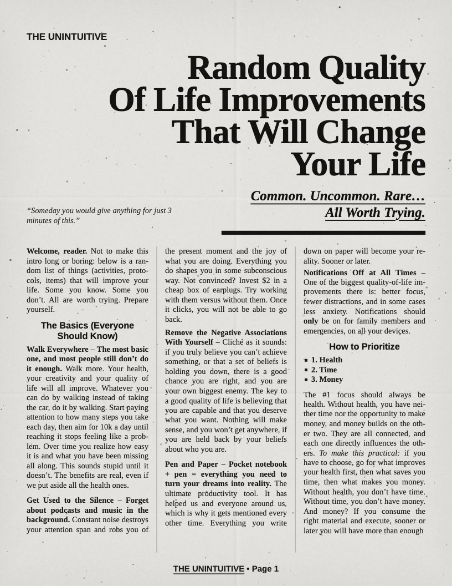
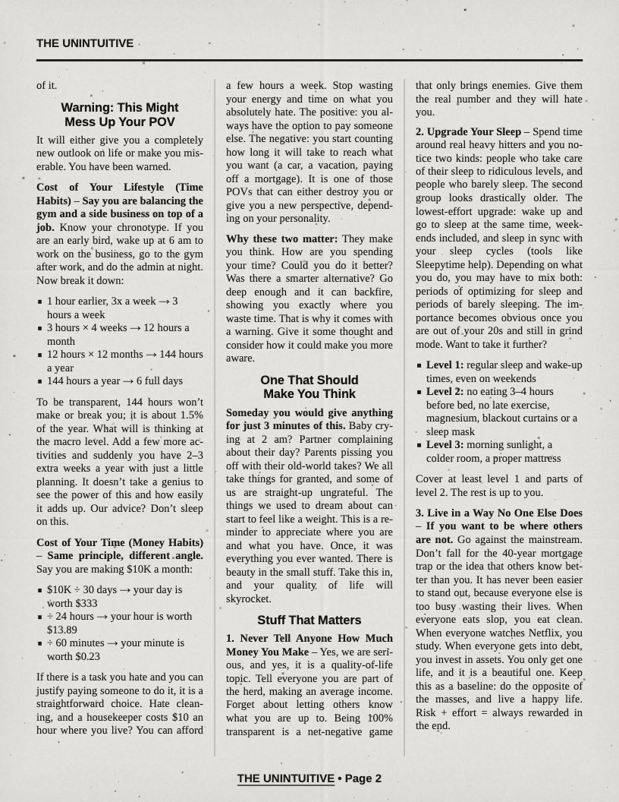
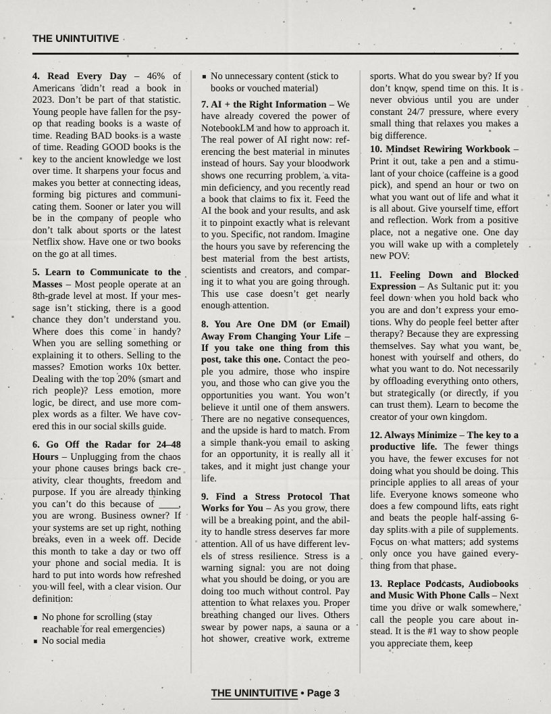
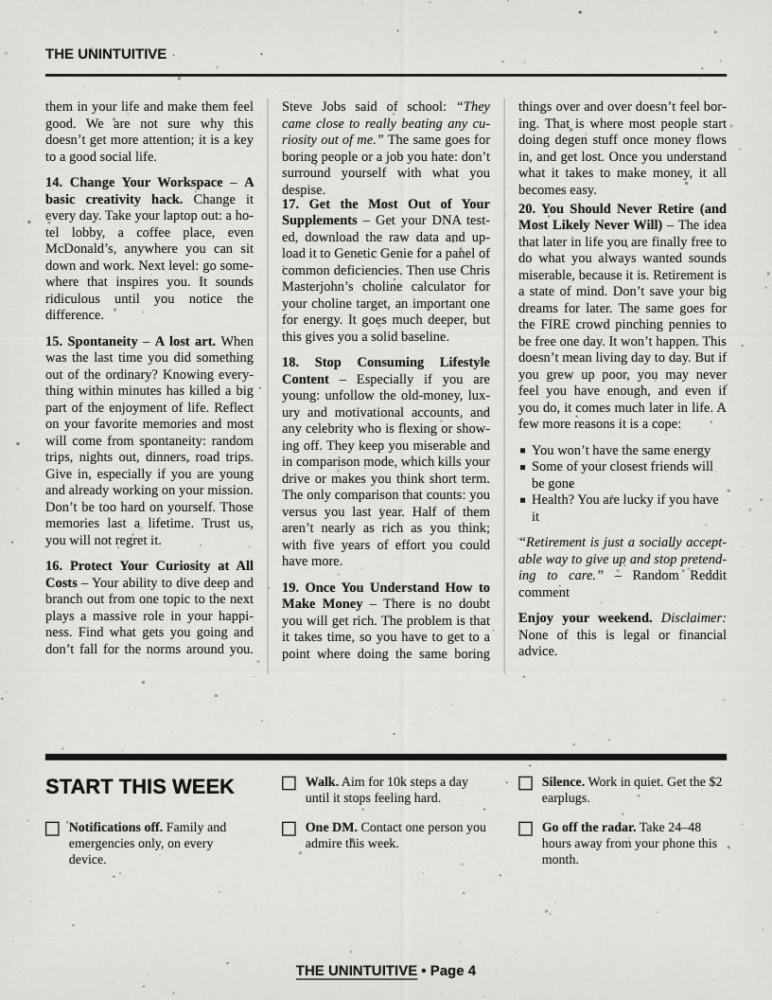

+++
title = "reads"
template = "single_section.html"
sort_by = "title"
in_search_index = false
+++

A small library of [STEM](/reads/stem/) material that I have enjoyed till now! I will clean this up when I get some time

[Worldly](/reads/worldly/) reads on startups, wealth, and society, money, the practical knacks of the world

[Otherworldly](/reads/otherworldly/) fiction, philosophy, and life ahhh

My father was right, I should read newspaper sometimes :

