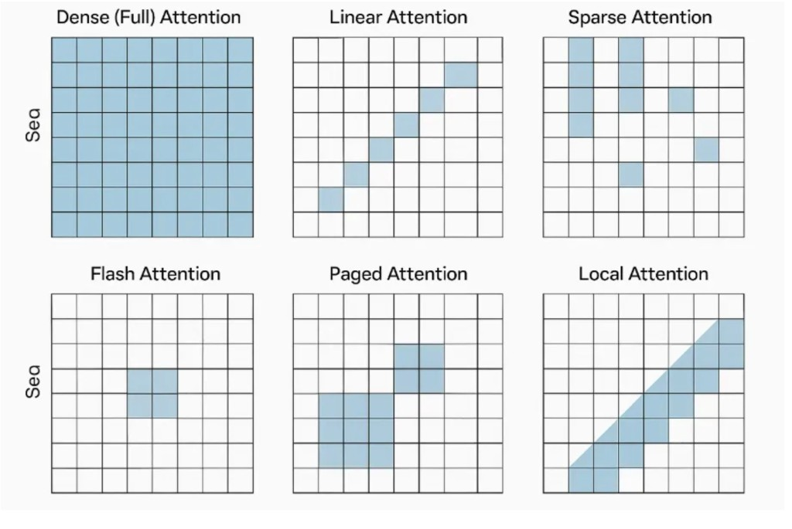
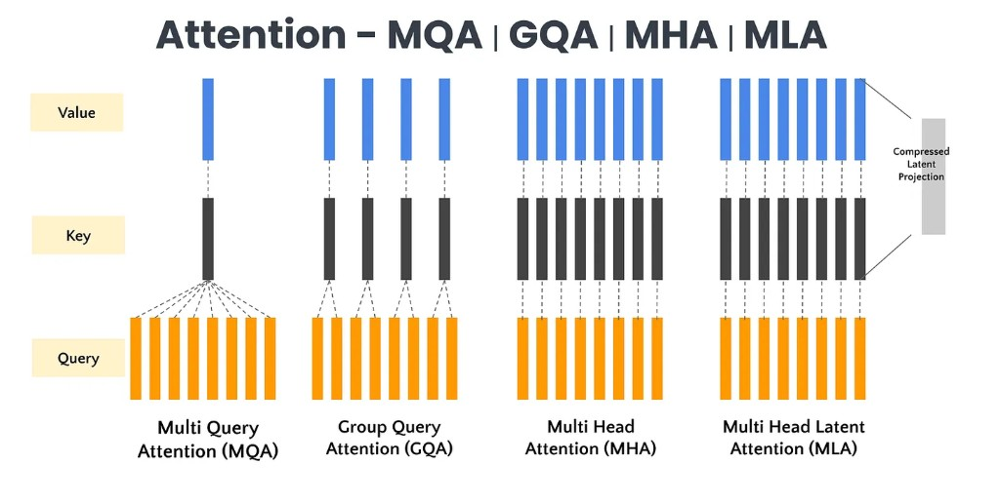
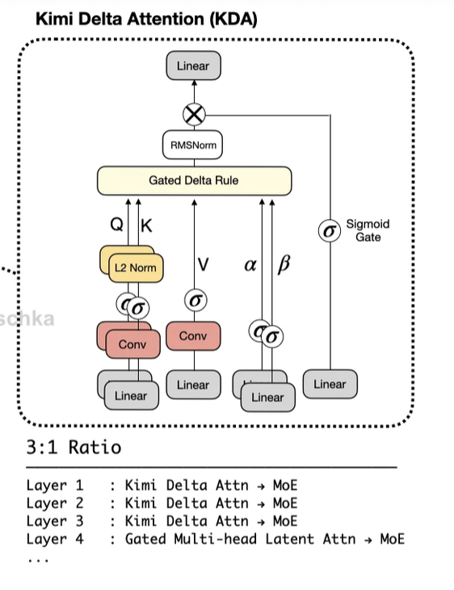
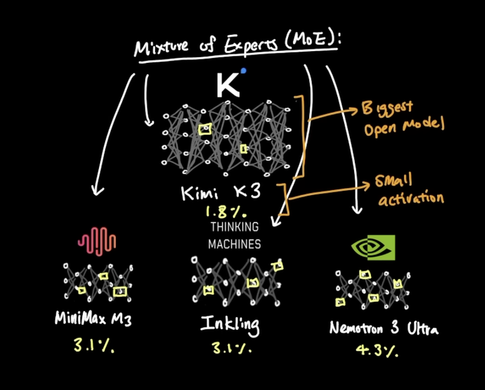
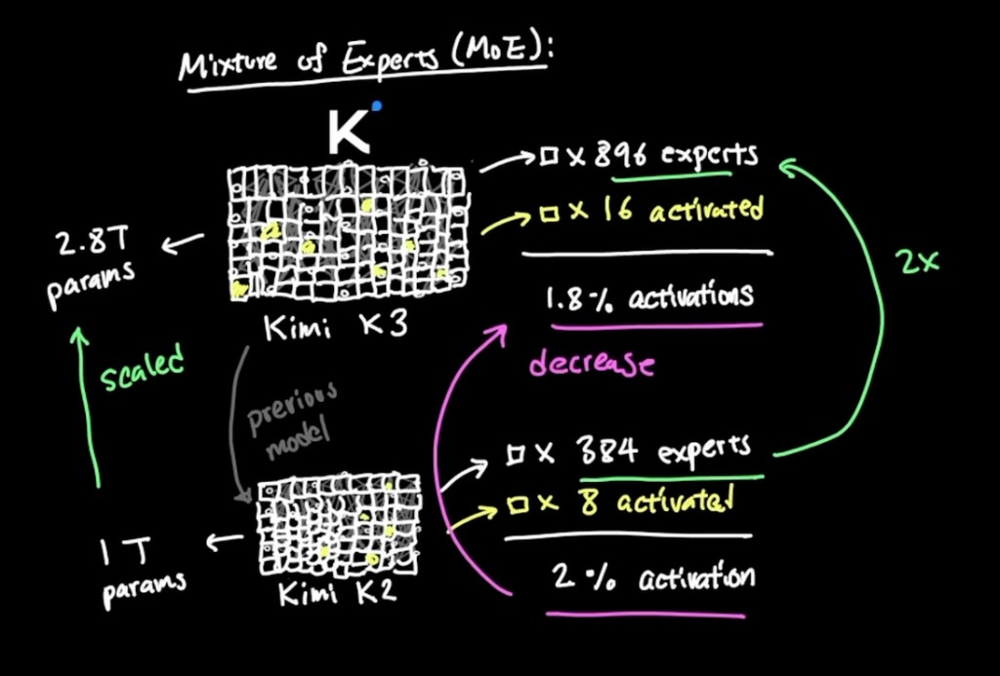
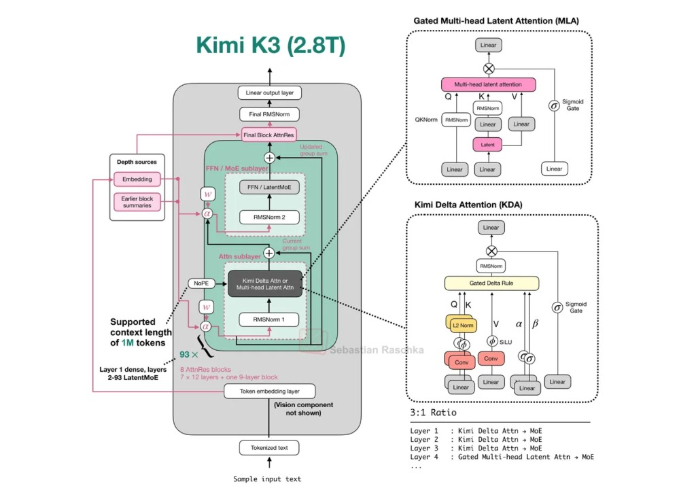

+++
title = "All sorts of famous Attention Layers"
date = 2026-07-18
description = "A tour of attention variants from classic softmax attention through modern efficient and sparse designs after Kimi K3."

[taxonomies]
tags = ["transformers", "attention", "ml", "llm"]
+++

Well, we had a bomb of Kimi K3 launch, and I writing this after going through it. So, we will trace this pokemon evolution.

## Basics

Before Transformers, models like RNNs and LSTMs processed text sequentially, word by word. This process was slow and models struggled to remember information from the distant past, creating a long-range dependency problem. The attention mechanism solved this by allowing the model to look at all parts of the input sequence simultaneously and assign importance (attention) scores to each word, creating a rich context vector. It abandoned sequential processing entirely, enabling parallel computation and providing the model with a direct, weighted memory of its entire input.

I mean, if you're reading my blogs, most probably you know what the attention is, but for reiteration, the standard softmax based attention equation looks like :
> Attention(k, Q, V) = softmax(QK^T^ / d^1/2^)V

The attention process :
```python
        B, T, C = x.size() # batch size, sequence length, embedding dimensionality (n_embd)

        # calculate query, key, values for all heads in batch and move head forward to be the batch dim
        q, k, v  = self.c_attn(x).split(self.n_embd, dim=2)
        k = k.view(B, T, self.n_head, C // self.n_head).transpose(1, 2) # (B, nh, T, hs)
        q = q.view(B, T, self.n_head, C // self.n_head).transpose(1, 2) # (B, nh, T, hs)
        v = v.view(B, T, self.n_head, C // self.n_head).transpose(1, 2) # (B, nh, T, hs)

        # manual implementation of attention
        att = (q @ k.transpose(-2, -1)) * (1.0 / math.sqrt(k.size(-1)))
        att = att.masked_fill(self.bias[:,:,:T,:T] == 0, float('-inf'))
        att = F.softmax(att, dim=-1)
        att = self.attn_dropout(att)
        y = att @ v # (B, nh, T, T) x (B, nh, T, hs) -> (B, nh, T, hs)
        y = y.transpose(1, 2).contiguous().view(B, T, C) # re-assemble all head outputs side by side

        # output projection
        y = self.resid_dropout(self.c_proj(y))
        return y
```
Once the final hidden-state matrix is produced, the language model head maps it into vocabulary logits. During autoregressive decoding, only the logits at the final position are needed to select the next token.


## There is a variety!

Linear Attention is not a variant of Self-Attention. I used to think that so clarifying here, some papers blur the line. MLA (DeepSeek) is still softmax-based but uses low-rank projections. The hybrid models like Kimi K3 or Qwen3 mix both.

it's a fundamentally different formulation that replaces the softmax based attention mechanism entirely.

> Attention = softmax(QK^T / √d) V # O(n²) - must compute full n×n matrix
> Attention = φ(Q)(φ(K)^T V) # O(n) - associativity trick

By removing softmax and using a kernel function φ, you can change the order of operations. instead of (QK^T^)V which requires the n×n matrix, you compute K^T^ V first (d×d matrix), then multiply by Q. This is the kernel trick that makes it linear.

```
Attention Mechanisms
├── Softmax-based Attention (Quadratic O(n²))
│   ├── Self-Attention (vanilla)
│   ├── Multi-Head Attention (MHA)
│   ├── Multi-Query Attention (MQA)
│   ├── Grouped-Query Attention (GQA)
│   ├── Sliding Window Attention (sparse, but still softmax)
│   └── Multi-Head Latent Attention (MLA) - low-rank, but still softmax
│
├── Faster Softmax Attention (same maths, better memory access via implementation optimizations)
│   ├── Flash Attention - tiled SRAM computation
│   ├── Flash Attention 2 - better parallelism
│   ├── Flash Attention 3 - Hopper optimizations
│   └── Paged Attention - dynamic KV cache allocation
│
├── Linear Attention (O(n), and no softmax)
│   ├── Linear Attention (Katharopoulos 2020) - kernel trick
│   ├── DeltaNet - delta rule updates
│   ├── Gated DeltaNet - with gating
│   ├── RetNet - retention mechanism
│   └── RWKV - time-mixing
│
└── State-Space Models (not attention at all)
    ├── S4
    ├── Mamba
    └── Mamba-2
```



The visualization makes the differences clear. Dense attention fills the entire matrix (O(n²)). Linear attention only tracks a diagonal state that grows with sequence position. Sparse attention skips positions. Flash Attention computes the same dense pattern but tiles it for better memory access. Paged Attention handles variable-length sequences with dynamic allocation. Local/Sliding Window attention restricts each token to only attend to nearby tokens.

## where to look? 
Memory is the bottleneck in inference :
* For every single token generated, the model must stream billions of parameters (weights) through the memory bus. The GPU spends more time moving data in and out of memory than doing actual mathematical calculations.
* The KV cache stores the context and history of a prompt. Longer prompts and agentic workflows require exponentially more space, which reduces concurrent request capacity and limits batch sizes

### when does it even matter? 
the attention mechanism matters less than you think (at moderate context). 
At 4k tokens with hidden_size=2048, the compute breakdown per transformer layer is roughly:
* Feed-Forward Network (FFN): ~130 GFLOPs (two matmuls: up-proj and down-proj through a 4x expansion)
* Attention (including QKV projections): ~70 GFLOPs

The quadratic Q@K^T attention itself is only ~2 GFLOPs (4000² × 64 per head × num_heads). That's a tiny fraction. The rest of attention's cost is the linear projections (Q, K, V, O), which are the same regardless of whether you use full attention, linear attention, Mamba, or anything else.

so, at sequence lengths below ~8k tokens, the attention pattern barely matters. The FFN dominates. Linear attention, sliding window, sparse patterns, they all optimize the O(n²) part which isn't the bottleneck. The O(n × d × 4d) FFN is. This changes above ~16k tokens where the quadratic attention term starts dominating

## Softmax Magic 

Softmax is a normalizing function that depends on all elements in its input:
> softmax(x_i) = exp(x_i) / Σ_j exp(x_j)

To compute the output for any single element, you need the sum over all elements. This is the coupling.

Applying to attention :
> attention_weights_t = softmax([q_t·k_1, q_t·k_2, ..., q_t·k_n])

To normalize q_t's attention over key k_5, you need to know q_t's dot product with k_1, k_2, k_3, k_4, k_6, ..., k_n. You can't compute the attention weight for one key without knowing the scores for all keys.

```
# What we want (efficient):
output = Q @ (K.T @ V)  # compute K.T @ V first: (d×n) @ (n×d) = d×d
                         # then Q @ result: (n×d) @ (d×d) = n×d
                         # Total: O(n·d²)

# What softmax forces:
scores = Q @ K.T         # n×n matrix - unavoidable
weights = softmax(scores, dim=-1)  # needs full row to normalize
output = weights @ V     # n×d
                         # Total: O(n²·d)
```
The softmax sits between the two matrix multiplications. You can't skip computing the n×n scores matrix because softmax needs all n scores in each row to produce each normalized weight.

```python
# Standard softmax attention (for comparison)
def forward(self, x, mask=None, past_kv=None):
    b, t, d = x.shape
    d_head = d // self.num_heads
    h = self.num_heads
    qkv = self.qkv_proj(x)

    q = qkv[:, :, :d].view(b, t, h, d_head).transpose(1, 2)
    k = qkv[:, :, d:2*d].view(b, t, h, d_head).transpose(1, 2)
    v = qkv[:, :, 2*d:].view(b, t, h, d_head).transpose(1, 2)

    # KV cache: concat past keys/values
    if past_kv is not None:
        k = torch.cat((past_kv[0], k), dim=2)
        v = torch.cat((past_kv[1], v), dim=2)

    # O(t²) attention computation
    scores = (q @ k.transpose(-1, -2)) / math.sqrt(d_head)
    
    if past_kv is None:  # prefill needs causal mask
        causal_mask = torch.triu(torch.ones(t, t, dtype=bool, device=q.device), diagonal=1)
        scores = scores.masked_fill(causal_mask, float('-inf'))

    attn = scores.softmax(-1)  # this breaks associativity
    o = attn @ v
    o = o.transpose(1, 2).contiguous().view(b, t, d)

    return self.o_proj(o), (k, v)
```

> Softmax Attention has perfect recoverability. Query k₅, get v₅.

### Self-Attension

It's at the core of transformer models.  Clearly, as HBM (around 1.5 TB/s) is not the fastest thing off GPU (its not on GPU, its a chip nearby), the K,V being stored in it are problematic. So, its quadratic complexity for HBM accesses with respect to sequence length at inference is clearly bad at scale.  Lots of techniques to reduce the amount of KV data transferred between the GPU and the HBM. 

```
Algorithm 0 - Standard Attention Implementation
Require: Matrices Q, K, V e RNxd in HBM.
1: Load Q, K by blocks from HBM, compute S = QKT, write S to HBM.
2: Read S from HBM, compute P = softmax(S), write P to HBM.
3: Load P and V by blocks from HBM, compute O = PV, write O to HBM.
4: Return O.
```

You can [refer Multi-Head Attention in BERT for reference](https://github.com/huggingface/transformers/blob/f208766a6551d381475cd8eeed1256f9a5af7b65/src/transformers/models/bert/modeling_bert.py#L143). 



The diagram shows the progression. In MHA every head has its own K and V. In GQA groups of heads share K and V. In MQA all heads share a single K and V. In MLA the K and V are compressed through a latent projection before being used.

### Multi-Query Attention

It's almost like Self-Attension. Just that Vi and Ki (i being used by each head) is not required. We can use same set of K and V across heads. So, just one K and one V tensor shared across all heads. Thus, [one head is all you need!](https://arxiv.org/pdf/1911.02150) So, a great optimization wrt to amount of data that would be required to be loaded via HBM. As the KV is cached as well, we need much less cache. Awesome! Less memory pressure (so you can batch more) and faster decoding on inference. But, there is a small accuracy drop as we have few params. Also, you have to train the model with MQA, can't just a MHA trained model and use MQA on inference. And, no Tensor parallelism as then we will kinda defeat the purpose by having KV replicated across clusters. 

The tradeoff is clear. MQA gives you efficiency by sharing keys and values but you lose some of the nuanced token level interactions that separate heads would capture. Each head still has its own queries so it can focus on different aspects of the input but the shared keys and values mean less diversity in what gets attended to.

You can [refer Falcon 7B for reference for MQA](https://github.com/huggingface/transformers/blob/f208766a6551d381475cd8eeed1256f9a5af7b65/src/transformers/models/falcon/modeling_falcon.py#L274)

### Group Query Attension

Well, it's between MHA and MQA. Just adding another hyparam to the equation, pairing up (K, V) to some heads. This gives best of both world, a nice compromise balance between speed and accuracy.  4 and 8 were quite good. Interesting thing here is that MHA models can be uptrained (not really fine-tuning, just an upgrade) to GQA.  And clearly a better fit to tensor parallelism. 

The way it works is that input queries get divided into groups. For each group a shared set of key and value representations is computed. Attention scores are calculated between the grouped queries and the shared key representations. The final output is a weighted sum of the shared value representations based on those attention scores. Then outputs of all query groups get combined to produce the final representation.

GQA scales more effectively with sequence length than MHA. Llama and Mistral both use it. The grouping preserves more diversity than MQA while still being more efficient than full MHA.

This can be [referenced from Llama 2](https://github.com/huggingface/transformers/blob/f208766a6551d381475cd8eeed1256f9a5af7b65/src/transformers/models/llama/modeling_llama.py#L209)

### Sliding Window Attention

In vanilla attention, we compute attention score from all token, and at inference time we mask becuase we dont want decoding to look at the future. We have a [triangle shaped attention mask](https://medium.com/@sayedebad.777/mastering-mistral-ai-from-sliding-window-attention-to-efficient-inference-22d944384788) which is quadratic. What SWA does is that it limits the self attention computation to a fixed window so we get a fixed cached size. So, we can't see more than window size from previous token. KV cache becomes a rotating buffer. So, the max context size would be window size * number of layers, reducing attention complexity to linear. So, we are shortening the attention span. 

Sliding window is just one type of sparse attention pattern. There are others worth knowing about. Strided attention has each token attend to every kth token which is useful for capturing periodic patterns. Reformer uses locality sensitive hashing to cluster similar queries and keys into buckets so queries only attend to keys in the same bucket giving O(n log n) complexity. BigBird combines random attention with local attention with global attention. Longformer uses local sliding window attention with task specific global attention where some tokens like CLS attend to all tokens while others use local attention.

The tradeoff with sparse patterns is loss of global context. Fixed patterns may miss long range dependencies. Choosing the right sparsity pattern is task dependent. But for long sequences the memory savings are worth it. Reformer can handle 64K tokens. Longformer works well for summarizing legal contracts or books.

You can refer [Mistral 7B paper](https://arxiv.org/pdf/2310.06825) and reference [sliding window causal mask code](https://github.com/huggingface/transformers/blob/f208766a6551d381475cd8eeed1256f9a5af7b65/src/transformers/masking_utils.py#L1118). 

### Flash Attenstion

As we know, HBM memory is slower to on-GPU memory. Wouldn't it be better to run the Self-Attension computation on GPU itself (with minimal HBM accesses)? Thats exactly what flash attention does.

The key insight is understanding the GPU memory hierarchy. Small SRAM has extremely high bandwidth around 19 TB/s but limited size around 20MB. HBM has higher capacity around 40GB but lower bandwidth around 1.5 TB/s. CPU DRAM has massive capacity over 1TB but much slower bandwidth around 12.8 GB/s. Flash Attention exploits this hierarchy by keeping intermediate results in fast SRAM instead of writing them to slow HBM.

```
Load Q and K from HBM once
Multiply Q and K, keep S in SRAM
Compute P incrementally in SRAM (tiling)
Materializes S = QKᵀ and P = softmax(S) and writes only the final output O
```
And, parallize over batch size and number of heads. 
Taking N as sequence length, d as embedding length and M as size of SRAM (d<=M<=Nd),
Flash Attention requires O(N^2^d^2^M^-1^) HBM accesses which still looks quadratic. But if M=N, then its O(Nd^2) HBM accesses, so linear wrt sequence length. This optimizes for forward and backward passes, so accelerate training. 

The tiling strategy is clever. It divides Q, K, V into blocks sized to fit GPU SRAM. The outer loop loads blocks of K and V from slow HBM into fast SRAM. The inner loop processes Q blocks against the loaded K and V blocks. This enables processing sequences up to 4x longer than conventional attention because you never materialize the full N by N attention matrix.

The fused kernel execution replaces the traditional multi step attention with a unified operation. It combines matrix multiply then scaling then masking then softmax then dropout then matrix multiply into one CUDA kernel. Intermediate results like QK transpose and softmax outputs stay in SRAM and registers. Only final attention outputs get written to HBM. This reduces HBM accesses by 10 to 20x compared to standard PyTorch implementations.

Later, there was FlashAttension-2 that did some rewriting to reduce number of non-matmul operations to maximize GPU throughput. Also, it optimize operations for Multi-Query Attention and Grouped-Query Attention. Even more sequence parallelism. Its over staggering 9x faster than standard attention. 

Refer the [FlashAttension Paper-1](https://arxiv.org/pdf/2205.14135) and [paper 2](https://arxiv.org/pdf/2307.08691). 

### Paged Attention

It's a [famous vLLM optimization which enables the KV cache memory grows and shrinks dynamically for each inference request](https://www.youtube.com/watch?v=5ZlavKF_98U). 

The problem with standard KV caching is that each request gets its own dedicated KV cache block. Tokens are appended sequentially forming a contiguous memory block. There is no sharing between sequences even if parts of their content are the same. This leads to memory waste due to fixed and unshared allocation and poor handling of varying prompt lengths across sequences.

Paged Attention draws inspiration from virtual memory paging in operating systems. It introduces a separation between logical KV cache blocks which is the abstract token layout that each sequence sees and physical KV cache blocks which is the actual memory pages storing keys and values that may be shared across sequences. Each token's data is stored in small fixed size memory pages. Pages are dynamically allocated and mapped via a page table. Multiple logical sequences can share the same physical memory if their tokens match like a common prefix. This enables non contiguous memory access through logical to physical translation.

Think of it like OS virtual memory where different processes see the same memory contents using their own mappings.

During generation the attention mechanism gathers keys and values for a sequence by following its page table. Sequences with shared prefixes map to the same physical cache blocks. When a sequence diverges Paged Attention uses copy on write. The shared page is cloned. Only the diverging sequence gets the new page. Reference count for shared pages is decremented. This ensures efficient memory use while allowing flexibility in generation.

THe KV cache without pagedAttention is a rectangle with batch vs max seq length. a lot of space wasted in the rectangle, because users dont really use the seq length to its max. we wanted to improve upon this device memory issue. pagedAttention allocates blocks in GPU memory. so you first load your model and see how much space you have left, and then everything else is filled with memory blocks. when new sequence comes in, we allocate as many blocks it needs for the prompt, and slowly grow them as needed.  The management of cache was kinda an old school OS problem in the hindsight. GPU memory fragmentation wastes memory and makes it difficult to increase batch size. So, Paged Attention simply divides the KV cache into fixed-size memory-aligned blocks (pages dont have memory between them), similar to virtual memory pages in operating systems and allocating pages reduces internal and external memory fragmentation.

Refer the [paper](https://arxiv.org/pdf/2309.06180).

### Multi-Head Latent Attention

Got introduced in Deepseek v2 (also used in v3). This literally avoids caching K, V altogether. A low-rank representation of K and V learned during training is cached instead (LoRA like). This gives us much less KV cache use (90%+ savings). Also, as metrix size is also reduced, a good 5-6x inference speedup is there. And interestingly higher accuracy than MHA is achieved.

The key innovation is introducing learnable latent embeddings that act as intermediaries between queries keys and values. These latent embeddings capture high level abstract patterns and enable more efficient cross token interactions. Instead of attending to all input tokens the attention focuses on these latent embeddings leading to faster computation.

The mechanics work like this. A fixed number of latent embeddings are initialized as part of the model. Input queries attend to these latent embeddings instead of the entire sequence which drastically reduces the number of pairwise interactions. The latent embeddings then attend to the original keys and values acting as intermediaries that distill context into meaningful patterns. Finally the results get projected back to the token space preserving critical token level information.

Compared to MHA which suffers from quadratic complexity MLA achieves linear or near linear complexity by compressing the attention space. Compared to MQA which uses a single shared key value pair MLA maintains diversity by having latent embeddings act as a middle layer allowing richer context capture. Compared to GQA which focuses on groups and can miss global dependencies MLA's latent embeddings inherently capture global patterns acting as global summaries.

The tradeoff is that compressing input tokens into latent embeddings may lose fine grained details critical for some tasks. The performance also depends on how effectively the latent embeddings are initialized and trained.

## Linear Magic

Linear attention removes the dependency that troubles Softmax.
```
# Feature map applied BEFORE the dot product
q_mapped = φ(Q)  # element-wise, no coupling
k_mapped = φ(K)  # element-wise, no coupling

# Now we can re-associate
output = q_mapped @ (k_mapped.T @ V)  # O(n·d²)
```
φ (like ELU+1) is applied element-wise - each element transforms independently. No normalization across the sequence. So you can legally reorder the multiplications

```
Softmax attention:
q_1 ──┬── score with k_1 ──┐
      ├── score with k_2 ──┼── softmax needs ALL ── weight_1
      ├── score with k_3 ──┤                        weight_2
      └── score with k_n ──┘                        weight_n

Linear attention:
q_1 ── φ(q_1) ──┐
                ├── can compute independently
k_1 ── φ(k_1) ──┘
```
With softmax, the denominator Σ exp(q·k_j) couples everything. Without it, each (q, k, v) triplet can be processed independently and accumulated into a running state.

The coupling in softmax gave it expressiveness. the competition between keys (via normalization) lets the model express "attend to this, not that" patterns sharply. Linear attention loses this competitive dynamic, which is why it's less expressive but more efficient.

### Linear Attention

As softmax applied nonlinearity after Q·K product, coupling every query to every key, we have O(n^2^), that is full N×N attention matrix before applying softmax, as I explained earlier. Linear attention trades expressiveness for efficiency. Softmax attention can express arbitrary attention patterns, any token can attend strongly to any other token. Linear attention's feature map constrains what patterns are representable. This is why modern hybrids (Kimi K3, Qwen3) use both! softmax layers for complex reasoning, linear layers for efficient long-range propagation.

Linear attention applies a feature map φ (such as ELU+1, or simply ReLU) to Q and K separately, before the dot product:

```
Softmax:  Attention = softmax(QK^T / √d) V     # must compute N×N first
Linear:   Attention = φ(Q)(φ(K)^T V)           # associativity trick
```

I had an obvious question, why ELU+1 is used as the feature map and how linear attention still preserves the attention contract despite removing softmax? Both softmax and linear attention preserve the same fundamental contract, they just implement it differently:
1. Make QK scores non-negative - Attention weights can't be negative (obviously). Softmax uses exp(x) which is always positive. Linear attention uses ELU+1, since ELU(x) ≥ -1 for all x, adding 1 guarantees non-negativity.
2. Normalize by dividing by sum - We still divide by Σ φ(q)·φ(k_j) to get proper weights. This is often omitted from diagrams but it's there.
3. Compute weighted average of values - Same as softmax

Also, ELU(x) is smooth unlike ReLU which helps gradients. It approximates the exponential kernel that softmax uses. Softmax's exp() function creates a sharper distribution, small differences in scores become large differences in weights. ELU+1 is flatter, so the attention distribution is more diffuse. The model can't say "attend ONLY to this token" as sharply. This is interesting kernel trick. 

Its the game of association. (AB)C = A(BC) from your Linear Algebra class. With softmax, you're forced into (QK^T^)V because softmax breaks associativity. Without softmax, you can compute (K^T^ V) first, that's a (d×N) × (N×d) = d×d matrix, independent of sequence length. Then multiply by Q. This means the growing history of K and V vectors can be folded into a fixed D×D state matrix S:
```python
# Recurrent form of linear attention
S = 0  # d×d state matrix
for t in range(seq_len):
    S = S + φ(k_t).outer(v_t)      # update state: O(d²)
    o_t = φ(q_t) @ S               # query state: O(d²)
```
You get it right? Constant memory, constant compute per token. No KV cache that grows with context.

```python

# Linear attention equivalent
def forward_linear(self, x, state=None):
    b, t, d = x.shape
    d_head = d // self.num_heads
    h = self.num_heads
    qkv = self.qkv_proj(x)

    q = qkv[:, :, :d].view(b, t, h, d_head).transpose(1, 2)
    k = qkv[:, :, d:2*d].view(b, t, h, d_head).transpose(1, 2)
    v = qkv[:, :, 2*d:].view(b, t, h, d_head).transpose(1, 2)

    # Apply feature map (ELU+1 is common)
    q = F.elu(q) + 1
    k = F.elu(k) + 1

    if state is None:
        state = torch.zeros(b, h, d_head, d_head, device=x.device)

    # For each position, update state and compute output
    outputs = []
    for i in range(t):
        # S += k_t ⊗ v_t  (outer product update)
        state = state + torch.einsum('bhd,bhe->bhde', k[:, :, i], v[:, :, i])
        # o_t = q_t @ S
        o_t = torch.einsum('bhd,bhde->bhe', q[:, :, i], state)
        outputs.append(o_t)

    o = torch.stack(outputs, dim=2)  # b, h, t, d
    o = o.transpose(1, 2).contiguous().view(b, t, d)

    return self.o_proj(o), state  # state is fixed d×d, not growing KV cache
```
> Notice the difference! softmax attention returns (k, v) that grow with sequence length. Linear attention returns a fixed-size state matrix.

If you see [original paper](tab:https://arxiv.org/pdf/2006.16236), they say `the cost per time-step for transformers scales with the square of the current sequence length` which might trip you up! Today we know Flash Attention makes softmax attention practical. Well the paper was released in 2020 (a different world altogether). 
```python
# 2020-era: recompute everything, no KV cache
def generate_token(model, all_previous_tokens):
    # Re-run full forward pass on ALL tokens
    q, k, v = model.qkv_proj(all_previous_tokens)  # O(t × d)
    
    # Materialize full t×t attention matrix
    attn_matrix = q @ k.T  # O(t² × d) compute, O(t²) memory
    attn_matrix = softmax(attn_matrix)
    output = attn_matrix @ v
    
    return output[-1]  # only need last token's output
```
Per-token decode cost was O(t²) without cache in 2020 which became O(t) with cache, and full sequence generation was O(N³) which now is O(N²). Rememeber, algorithmic complexity is not implementation complexity.

> Linear Attention has no recoverability guarantee. Query k₅, get a mixture influenced by all tokens with similar keys.

### DeltaNet

Look at Linear Attention State update :
> S = S + φ(k_t).outer(v_t) # additive update

Softmax Attention (KV Cache) :
```
Cache = [k₁, k₂, k₃, ..., kₙ]  # each token gets its own slot
        [v₁, v₂, v₃, ..., vₙ]  # perfect isolation, O(N) memory
```
Linear attention (state matrix):
```
S = k₁⊗v₁ + k₂⊗v₂ + k₃⊗v₃ + ... + kₙ⊗vₙ  # all compressed into D×D
```
When you query with q_t, softmax can retrieve v₅ in isolation by attending only to k₅. Linear attention retrieves:
```
o_t = q_t @ S = q_t @ (k₁⊗v₁ + k₂⊗v₂ + ... + kₙ⊗vₙ)
```
The information from all previous tokens is superimposed. If k₃ and k₇ are similar, their values interfere, you can't cleanly separate them. This is called retrieval interference or memory interference. The D×D state matrix has finite capacity. With N tokens compressed into D² slots, information must overlap when N > D². Even before that limit, similar keys cause interference.

DeltaNet addresses this by using the delta rule from associative memory literature, instead of pure addition. the insightful thing here is, instead of blindly adding k⊗v to the state, subtract what's already there for that key first:
```
# Linear attention (naive additive)
S = S + k_t ⊗ v_t

# DeltaNet (delta rule)
S = S + k_t ⊗ (v_t - S @ k_t)
#              ↑ this is the "delta" - the error/correction
```
The term (v_t - S @ k_t) is the delta, the difference between what we want to store (v_t) and what we'd currently retrieve for this key (S @ k_t).

Why this helps:

* If k_t is similar to a previous key, S @ k_t already contains that value
* We only add the correction, not the full value
* This reduces interference from similar keys
* It's inspired by Hopfield networks and fast weight programmers

> This has better recoverability. The delta rule acts like an error correcting update, it tries to make S @ k = v hold for each stored (k, v) pair

As we see in [Fast Weight Programmers](https://arxiv.org/abs/2102.11174): 

> "when the sequence length exceeds storage capacity, the model may end up in an overcapacity regime. To properly operate under such a regime, the model should learn to dynamically interact with the memory contents and selectively decide which key-value associations to keep and which ones to delete. The purely additive instruction may be inappropriate for this purpose… endlessly adding new associations to a memory of finite size, as in Eq. 17, inevitably will reach a limit."

The regime that makes linear attention attractive (N >> D) also exposes its main limitation. Once the state exceeds its effective capacity, associations begin to interfere because the update is purely additive, nothing ever leaves the cache.

```python
def forward(self, x, mask=None, cache=None):
    b, t, d = x.shape
    d_head = d // self.num_heads
    h = self.num_heads
    qkv = self.qkv_proj(x)

    q = qkv[:, :, :d].view(b, t, h, d_head).transpose(1, 2)
    k = qkv[:, :, d:2*d].view(b, t, h, d_head).transpose(1, 2)
    v = qkv[:, :, 2*d:].view(b, t, h, d_head).transpose(1, 2)

    q = F.normalize(F.silu(q), dim=-1)     
    k = F.normalize(F.silu(k), dim=-1)     
    beta = torch.sigmoid(self.w_beta(x)).view(b, 1, t, 1)  # per-token write strength

    S = cache if cache is not None else 0.0  

    v_old = k @ S              # read what's currently stored at this key
    u = beta * (v - v_old)     # the delta: only what's actually new
    S = S + k.transpose(-1, -2) @ u  # write the correction

    o = q @ S                  # read with query
    o = o.transpose(1, 2).contiguous().view(b, t, d)
    return self.o_proj(o), S
```

The update first asks what information the current key retrieves from the cache (v_old = k @ S). It subtracts that existing information from the value we want to store, multiplies by beta (write strength), and adds the result back. Old information is removed and new information is written in its place.

### Gated DeltaNet

[Gated DeltaNet](https://arxiv.org/abs/2406.06484) adds gating to control how much of the old state to retain vs. overwrite:
```python
# Gated DeltaNet
β = sigmoid(gate_proj(x))  # forget gate, per-token
S = β * S + k_t ⊗ (v_t - β * S @ k_t)
```
The gate β controls:
* β ≈ 1 - retain most of old state (long-term memory)
* β ≈ 0 - forget old state (fresh start)

This is analogous to LSTM's forget gate. it lets the model learn when to forget rather than accumulating everything forever. The model can now selectively decide which associations to keep and which to delete, addressing the overcapacity problem Schlag identified.

### RetNet

While DeltaNet was figuring out the delta rule, Microsoft was working on a different angle. [RetNet](https://arxiv.org/abs/2307.08621) (Retentive Network) came out in 2023 with a bold claim, they literally called it a successor to Transformer.

The core idea is the retention mechanism, which is basically linear attention with exponential decay. Instead of the ELU+1 feature map, RetNet uses a decay factor γ that makes older tokens contribute less:

```python
# RetNet retention (simplified)
S_t = γ * S_{t-1} + k_t ⊗ v_t
o_t = q_t @ S_t
```

The γ (typically 0.9-0.99) acts like a built-in forgetting mechanism. Older associations naturally fade away, which addresses the overcapacity problem without needing the delta rule's explicit correction.

What made RetNet interesting was the three computation paradigms:
- Parallel mode: For training, unfold the recurrence into a matrix form (like standard attention but with a decay mask)
- Recurrent mode: For inference, O(1) per token like linear attention
- Chunkwise mode: Hybrid for long sequences - parallel within chunks, recurrent across chunks

Sound familiar? This is exactly the chunking trick that DeltaNet later formalized. RetNet got there first, though with a simpler (non-delta) update rule.

In practice, RetNet showed up in Microsoft's TorchScale library and influenced later work like YOCO (You Only Cache Once). The Gated RetNet variant added gating similar to Gated DeltaNet. But RetNet never quite took off in production the way the authors hoped, the successor to Transformer claim was kinda premature. Still, the multi-paradigm formulation was influential.

### RWKV

[RWKV](https://arxiv.org/abs/2305.13048) is the weird one. It's not quite attention, not quite an RNN, but somehow both. The name comes from its four main parameters, Receptance, Weight, Key, Value.

The project started as a community effort by BlinkDL and grew into something surprisingly capable. RWKV-4 was the first version that really worked, scaling up to 14B parameters - the largest dense RNN ever trained at the time.

The core mechanism is time-mixing with learned decay:
```python
# RWKV time-mixing (simplified)
wkv_t = Σ_{i=1}^{t-1} e^{-(t-1-i)w + k_i} * v_i + e^{u + k_t} * v_t
o_t = sigmoid(r_t) * wkv_t
```

The `w` is a learned decay (like RetNet's γ but in log-space), `u` is a bonus for the current token, and `r` (receptance) gates the output. It's inspired by Apple's AFT (Attention Free Transformer) but with crucial modifications that make it actually trainable.

What's cool about RWKV:
- 100% attention-free: No QK^T computation at all
- Parallelizable training: Can be formulated as a convolution
- RNN inference: O(1) memory and compute per token
- Actually deployed: There's a whole ecosystem RWKV-Runner for local inference, rwkvserve for production APIs

The architecture kept evolving:
- RWKV-5 "Eagle" and RWKV-6 "Finch": Added matrix-valued states and dynamic recurrence
- RWKV-7 "Goose": Incorporated a generalized delta rule (yes, the same delta rule from DeltaNet!)

From the [RWKV-7 paper](https://arxiv.org/abs/2503.14456):
> "RWKV-7 introduces a newly generalized formulation of the delta rule with vector-valued gating and in-context learning rates"

So the field is converging, RWKV started from RNNs and added delta-rule-like updates, while DeltaNet started from linear attention and added gating. They're meeting in the middle.

RWKV is actually used in production. The community has trained models up to 14B parameters, there are multilingual variants, music generation models, and even edge deployment with quantization. It's one of the few non-Transformer architectures that has a real user base beyond research papers.

#### The Prefill Problem

All the code I've shown so far has a dirty secret - it's sequential. Look at the linear attention loop:

```python
for i in range(t):
    S = S + k[:, :, i] @ v[:, :, i]  # can't parallelize - each step depends on previous S
    o = q[:, :, i] @ S
```
Each step depends on the previous state. GPUs hate this. They want big parallel matrix multiplies, not tiny sequential ones. This is why naive linear attention is slower than Flash Attention in practice despite being O(n) vs O(n²).

The [DeltaNet](tab:https://arxiv.org/pdf/2406.06484) paper solves this with chunking. Split the sequence into chunks of size C, then within each chunk, do normal quadratic attention (parallel, GPU-friendly) and across chunks, use the recurrent state update (sequential, but only T/C steps instead of T)

```python
S = torch.zeros(b, h, dh, dh) if cache is None else cache
outs = []
for i in range(t // C):
    q_c = q[:, :, i*C:(i+1)*C]  
    k_c = k[:, :, i*C:(i+1)*C]  
    v_c = v[:, :, i*C:(i+1)*C]

    # contribution from all previous chunks (recurrent)
    o_prev = q_c @ S
    
    # contribution from within this chunk (parallel attention)
    attn = (q_c @ k_c.transpose(-1, -2)).tril()  # masked
    o_curr = attn @ v_c
        
    o = o_prev + o_curr
    
    # update state for next chunk
    S = S + k_c.transpose(-1, -2) @ v_c
    outs.append(o)

o = torch.cat(outs, dim=2)
```
The cost splits into two parts:
* Fixed: 2Ld² for state updates (doesn't depend on C)
* Growing: 2LCd for the within-chunk attention matrices

Setting C=N recovers full O(N²) attention. Setting C=1 gives pure sequential linear attention. In practice, C=64 or C=128 works well because that's the granularity where tensor cores (UMMA instructions) operate efficiently.

#### Chunking DeltaNet is Harder

The chunking trick doesn't directly work for DeltaNet because the delta correction needs the current state:

```
v_old = k_i @ S  # need S at this exact moment
u_i = beta * (v - v_old)
```

You can't batch this naively. The paper's solution is a mathematical reparameterization that rewrites the delta update as a matrix recurrence with Householder-like transition matrices. This allows computing all C deltas within a chunk simultaneously using a forward substitution trick.

I won't pretend I understood this tbh. It took me hours to grasp a little. The key insight is that the sequential dependency can be "unrolled" into a form where you solve a triangular system once per chunk, then everything else parallelizes.

The full chunked DeltaNet forward pass looks something like:
```python
def chunk_delta_rule_forward(Q, K, V, beta, C):
    L, d = Q.shape
    Q, K, V = map(lambda x: x.reshape(-1, C, d), [Q, K, V])
    beta = beta.reshape(-1, C)
    
    K_beta = K * beta.unsqueeze(-1)
    V_beta = V * beta.unsqueeze(-1)
    
    # Forward substitution for the correction terms
    T = -(K_beta @ K.t()).tril(-1)
    for i in range(1, C):
        T[i, :i] = T[i, :i] + (T[i, :, None] * T[:, :i]).sum(-2)
    T += torch.eye(C)
    
    W = T @ K_beta
    U = T @ V_beta

    # Chunked parallel computation
    S = torch.zeros(d, d)
    O = torch.empty_like(V)
    
    for i in range(L // C):
        q_i, k_i, w_i = Q[i], K[i], W[i]
        u_i = U[i] - w_i @ S  # corrections for this chunk
        
        o_inter = q_i @ S  # cross-chunk contribution
        A_i = (q_i @ k_i.t()).tril()
        o_intra = A_i @ u_i  # within-chunk contribution
        
        S += k_i.t() @ u_i  # update state
        O[i] = o_intra + o_inter
        
    return O.reshape(L, d)
```
The forward substitution (the T matrix computation) is the magic that makes this work. It precomputes how each position's delta affects subsequent positions within the chunk.

####  Kimi Delta Attention (KDA)



The core innovation is Kimi Delta Attention (KDA), which extends Gated DeltaNet with fine-grained gating. Instead of a single scalar decay β, KDA learns a separate decay value for each channel:
```python
# Gated DeltaNet: single scalar gate
β = sigmoid(gate_proj(x))  # shape: (batch, seq, 1)
S = β * S + k_t ⊗ (v_t - β * S @ k_t)
# KDA: per-channel gate (fine-grained)
α = sigmoid(alpha_proj(x))  # shape: (batch, seq, d_head)
# each dimension of the state decays at its own rate
```

The diagram shows the full KDA block. Q and K go through L2 normalization and convolutions. V goes through a convolution as well. The α and β parameters come from separate linear projections with sigmoid gates. Everything feeds into the Gated Delta Rule which is the core state update. The output goes through RMSNorm and a final linear projection. The 3:1 ratio at the bottom shows how layers are arranged in Kimi Linear and K3. Three KDA layers followed by one Gated Multi-head Latent Attention layer then repeat.

Why does this matter? The D×D state matrix has limited capacity. With a single scalar decay, all channels forget at the same rate. With per-channel decay, the model can:
* Keep some channels as long-term memory (high α)
* Use other channels as short-term scratch space (low α)
* Learn which information needs persistence vs. which can be overwritten

## Kimi Linear

This was Moonshot AI's approach before K3. The idea was simple, if softmax attention is expensive at long contexts and linear attention loses expressiveness, why not use both?

[Kimi Linear](tab:https://arxiv.org/abs/2510.26692) made a bold claim :
> "We introduce Kimi Linear, a hybrid linear attention architecture that, for the first time, outperforms full attention under fair comparisons across various scenarios—including short-context, long-context, and reinforcement learning (RL) scaling regimes."

They used a hybrid architecture:
- Early layers: Linear attention (cheap, handles long-range dependencies)
- Later layers: Softmax attention (expensive, but more expressive for final reasoning)
The intuition is that early layers do broad gathering of information across the context, while later layers do precise reasoning that benefits from softmax's sharp attention patterns.


Kimi Linear doesn't use KDA alone. It interleaves KDA layers with Multi-Head Latent Attention (MLA) layers in a 3:1 ratio. The obvious question that would come to anyones mind is why MLA? MLA (from DeepSeek) is a softmax-based attention that uses low-rank projections to reduce KV cache size. By mixing KDA (linear, O(1) state) with MLA (softmax, but compressed), Kimi Linear gets:
* 75% reduction in KV cache compared to full MLA
* Up to 6× decoding throughput at 1M context length
* Better quality than pure MLA on benchmarks

The paper also replaces the standard MLP with [Mixture-of-Experts (MoE)](https://arxiv.org/abs/1701.06538), but that's orthogonal to the attention innovation.

### The MoE Landscape

Speaking of MoE, here's where things get interesting. Kimi K3 isn't just big, it's efficiently big.



The activation percentage tells you how much of the model actually runs per token:
* Kimi K3: 1.8% activation (104B of 2.8T parameters)
* MiniMax M3: 3.1% activation
* Inkling (Thinking Machines): 3.1% activation  
* Nemotron 3 Ultra (NVIDIA): 4.3% activation

K3 is currently the biggest open MoE model, but what's more impressive is the small activation ratio. Lower activation means faster inference and lower memory bandwidth requirements. The 1.8% figure means K3 activates roughly half the proportion of parameters that competitors do, while still achieving competitive quality.

The scaling from K2 to K3 tells the story:



K2 had 1T parameters with 384 experts, activating 8 per token (2% activation). K3 scaled to 2.8T with 896 experts, activating 16 per token. The math: they nearly tripled the total parameters but only doubled the activated parameters. More experts, sparser activation, better efficiency. This is the MoE scaling playbook - grow the expert pool faster than you grow the activation budget.

This worked reasonably well but had a problem: the transition between linear and softmax layers created a representation mismatch. Information compressed into the D×D state matrix had to be "unpacked" for softmax layers to use effectively.

Previous hybrid approaches (like the early Kimi experiments) stacked linear and softmax layers in separate sections. Kimi Linear interleaves them throughout, which helps maintain representation compatibility. The 3:1 ratio was determined empirically, enough KDA for efficiency, enough MLA for expressiveness.

## Kimi K3

K3 scales the Kimi Linear architecture to 2.8 trillion parameters with 104 billion activated (it's an MoE model). To put that in perspective: one K3 contains roughly 22,580 GPT-2 models worth of parameters.
But the interesting part isn't the scale. It's what they scaled. K3 uses the same KDA + MLA hybrid from Kimi Linear, but with several additions:



The diagram shows the full picture. On the left, the overall architecture: 93 transformer blocks with the 3:1 KDA/MLA ratio (layers 1-3 use KDA, layer 4 uses MLA, repeat). Layer 1 is dense, layers 2-93 use LatentMoE. On the right, the two attention mechanisms side by side - Gated MLA (softmax-based with latent compression) and KDA (the delta rule with per-channel gating via α and β).

### Native Multimodality

K3 is natively multimodal - vision is built into the architecture from the start, not bolted on. The linear attention layers handle the massive context that images require (a single high-res image can be thousands of tokens), while MLA layers do the cross-modal reasoning

### Stable LatentMoE
Training a 2.8T parameter model is hard. K3 uses a Stable LatentMoE framework that combines:
- The MuonClip optimizer (from [Kimi K2](tab:https://arxiv.org/pdf/2507.20534)) for training stability
- Careful expert routing to prevent collapse
- Latent representations that compress the expert outputs

### 1M+ Context Window
The combination of KDA's O(1) state and MLA's compressed KV cache enables a 1 million token context window that's actually usable in practice. At 1M tokens, full softmax attention would require ~1TB of KV cache memory. K3's hybrid approach reduces this to something that fits on a single node

### The Progression
Looking at the evolution:
| Model | Attention | Key Innovation |
|-------|-----------|----------------|
| Linear Attention | Additive state | O(1) memory, but interference |
| DeltaNet | Delta rule | Better recoverability |
| Gated DeltaNet | Scalar gate | Selective forgetting |
| KDA (Kimi Linear) | Per-channel gate | Fine-grained memory control |
| K3 | KDA + MLA hybrid | Scale + multimodality |

Each step adds capacity to address a concrete limitation in the preceding system. This isn't "make it bigger and hope" - it's targeted architectural improvements that compound.

## What happens after for text generation? 

Yeah, so the model actually did the job. The job of the model is to give out out probabilities. That's it. Generally, GPT architectures and all sorts of modern LLM architectures are decode-only, so there is no real encoder. The inputs are the prompts, and it simply generates the probabilities. It has nothing to do with text generation. After that, we have to pick those tokens that the model has generated. 

* The attention outputs are for the input sequence that we have, that is the prefill that we have done, first of all, stored in the KV cache
*  then we retrieve the attention output for the last token in the input sequence
* Then, to get the output weights, we make it go through a linear layer (that is, a projection layer). After which we just simply multiply the transpose of the output weights to the attention output, and we get the logits. Then we take a softmax of those logits. 
* only after this do we decode the token, and decoding can happen in multiple ways:
- We can do it greedily, so just picking up the token with the highest probability.
- We can do some sort of sampling, so any top-k sampling in which we can pick the token from the k most likely tokens.
- Any top-p decoding as well, in which we pick a token from the smallest subset of tokens such that their cumulative probability exceeds the p threshold.
A fancier way of making the models' output more creative
* And at last, we simply use the new token as the next input 

## hybrid attention models need their kernels

The code example I have shared shows the naive sequential loop for clarity. In practice, you'd use chunked parallel computation (which is what flash linear attention kernels do). The sequential form is pedagogically useful but would be slow without proper kernelization.

K3 demonstrates that linear attention variants can scale to frontier model sizes when combined thoughtfully with softmax attention. The hybrid approach isn't a compromise, it's genuinely better than either pure approach for long-context workloads. The catch? You need the kernels. All of this efficiency is theoretical without optimized CUDA implementations. Moonshot open-sourced their KDA kernel and vLLM integration, which is why Kimi Linear actually achieves the claimed speedups in practice.

To make this clearer, a practical titbit. Qwen3.5-2B uses a hybrid architecture, some layers are full quadratic attention (standard softmax), some are linear attention (avoiding the n² computation). Sounds great for efficiency. But without the flash-linear-attention CUDA kernels installed, the linear attention layers will fall back to a naive sequential torch loop, processing tokens one by one instead of in the efficient chunked/parallel form. The result is fuked up 5-6x worse speed loss. The linear attention layers are theoretically O(n) instead of O(n²). But the naive implementation is worse than a well-optimized O(n²) Flash Attention because Flash Attention's tiled memory access pattern is so cache-friendly that it beats an algorithmic advantage destroyed by poor memory access patterns. algorithmic complexity means nothing without implementation quality. A well-kernelized O(n²) beats a poorly-implemented O(n) every time on real hardware. This is why Flash Attention dominates! not because quadratic is somehow better, but because [Tri Dao spent years making the memory access pattern perfect for GPU cache hierarchies](https://web.stanford.edu/class/archive/cs/cs224n/cs224n.1244/slides/cs224n-2024-lecture18-deployment-and-efficiency.pdf).

## Conclusion

Softmax → Linear (efficiency, but interference) → DeltaNet (correction) 
→ Gated (forgetting) → KDA (fine-grained) → Hybrids (best of both)