+++
title = "Accepting that shiny job offer?"
date = 2026-08-14
draft = false
description = "Career notes from accepting a new-grad offer in 2026: interviews, negotiation, ghosting, and advice that still holds today."

[taxonomies]
tags = ["career", "startups", "interviews"]
+++

Okay, so finally I have accepted a full-time offer from an early stage startup (dangerous choice isnt it). During my journey of talking to founders, HRs, giving 50ish interviews, I have realized a lot. tbh a lot for a naive out of uni kid! Also, was helping bunch of folks (internships to new grads to seniors) to clear interviews in this new agentic world, so have some third-party perspective as well. I have received lots of mails of people who have been reading the stuff I write and it helping them (thanks for reading guys). So, I am writing this blog, according to 2026 reality. I hope the upcoming generation of engineering and researchers have it better than me ;(

one thing that I realized is that the most accomplished person you know may not have relevant actionable career advice for you. they can offer immense wisdom, but you should also seek out successful people in their early/late 20s who’ve been successful in the current job market. you can’t look at someone’s linkedin trajectory and assume trying to replicate it would plan out the same way now. Things are really different now. But i am writing this as I have collected some wisdom (or you can say patterns) talking to 27 senior engineers and 13 researchers (before saying yes to my first new grad offer I was doing my due diligence for a month or so), so I am sharing it here.

A lot of my smart friends, even after doing everything right, either got there offer revoked, or didn't receive full-time conversion offer in 2026. Too many, just too many people, unsatisfied, going for Masters. Ghosting is literally default right now. After final round, or negotiation period, the HR simply ghosts. The onboarding is either too fast (like literally they want you to start tomorrow) or too slow (basically offer can be easily revoked). Everything is on fire, hiring is immediate, yada yada, and when it comes to giving out actual offers letter, gone! It seems like candidates have an abusive relationship with companies atp. 

## Who are you?
In this age of AI, you are not a programmer, but a problem-solver, and the high-level problem to solve is how to make the business go brrr. I dont want to reduce things to just one axis, but simplistically, you are either increasing revenues or reducing costs. That's something to keep in mind. I don't know how to drill this in the minds of my junior ICPC addict nerds and research friends, customers dont really cares about esoteric programming, it's just a bloody proxy. You will find some random Physics major girl coding in her emacs in starbuck like a fukcing psycopath and piss your pants. You are most probably not even a good programmer after you agentic addiction. And, nobody is hiring nerds for having fun with them on yachts. Beautiful software is not the goal. Nor working with latest programming language and technologies. There are companies with idiot HR policies where lack of a buzzword means you won’t be selected. You don’t want to work for them, believe me. Sometimes I think, people are not understanding what good engineers are? Confusion everywhere. Any body who understands one language deeply, will ramp upto another pretty quickly. Just because someone has classical ML experience doesnt mean they can't do AI Engineering! 

You are an asset to make money in a business. Somewhere, think of yourself like that. I love quants because of this. There whole work is to use geeky maths and computers to make money. If they make the firm make billions of dollars, well there bonus is enough to FIRE. 

Anyways, just stay close to center of activity. Be aware of client being pursued, areas company is ramping up its investments in. It helps in the long run. Information and opportunities are not uniformly distributed. If you are at the right place, you can actually see the future in front of you, and then you will be at the right time (that is become lucky). I decided to join onsite because there is a value in proximity that cant really be recorded in a spreadsheet.

Normal pushback, but brooo what about craftsmanship? Well, you should be able to [say](https://flownet.com/ron/xooglers.html) :
> I did end up writing the credit card billing and accounting system, which is a nontrivial thing to get right. Fortunately for me, just before coming to Google I had taken some time to study computer security and cryptography, so I was actually well prepared for that particular task. ...I designed the billing system to be secure against even a dishonest employee with root access (which is not such an easy thing to do). I have no idea if they are still using my system, but if they are then I'd feel pretty confident that my credit card number was not going to get stolen.

Be good at what you do, not to get a job, but to not stay miserable when working. Too much imposter syndrome is just a sign that you need to go back to studying. Anxiety is not always bad.  

The job of engineer is solving business problem with code. But you will most probably never hear an executive say - "The biggest issue we have is that we need to ship 100k lines of code". In my personal experience, biggest problems are with humans, not computers. Don't flaunt tokenmaxxing and agents working in parallel. Flaunt revenue, reliability, customer satisfaction, actual business metrics. Its not how hard you have sweat, its how many mountains you have moved.

## Who is getting hired in this fucked up market? And how is the experience?

Most jobs (that you actually want to get) are never available publicly (it's mostly useless to apply to job openings in this day and age, dont do LinkedIn open to work shit), just like most top-tier candidates are simply not available publicly to hire. It's really really [fucking hard to hire](https://paulgraham.com/hiring.html)! competent people just have too many options. and a lot of people (and companies) are shady (i am not hinting towards people not being able to explain their own resume, like literally, people do fake info). Even as a normal person, I am not joking, the number of LinkedIn DMs and emails I get on monthly basis is weird. If you are competent (publicly and anyways tech is small, people know people), founders will throw money at you like a fucking gambler.

And dont be lured with just money (if you are a good engineer, you are making money in long run dont sweat it), pay very close attention to culture. CULTURE is the singlemost important thing that decides your experience in the company. You dont want to be that person who keeps on leaving companies in 6 months collecting stupid joining bonuses. I dont recommend taking money over culture. Just becuase the team seems technically smart, the founders are MIT PHDs (and other things that VCs love like Olympiad medalists, and more), does not mean they are good at managing people (its really hard). I have talked to founder who were Directors and VPs at almost all big tech (FAANG+other big ones) while interviewing, and unfortunately, I haven't had much nice experience with some of them (some expect 996, some want me to forward them competing offer letters which is not something you can do tbh, some with 90days notice period, and really common one is getting late to meetings and no remorse for that at all). For some reason, I think as new grad, people consider you really desperate? I was not. I clearly had no problems clearing interviews and getting offers. Just because someone has a big title, in this capitalistic world, does not mean they have your best interests in mind. On the contrary, the new generation founders were much better as humans.

Again a sidenote, the networking word is thrown around for new grads quite a lot. it just means that you meet people who at some point can do things for you (and hopefully vice versa) and making a favorable impression on them. Help people, don't be a selfish jerk (especially when it comes to someone's employment, it's serious shit). If you ever can’t help someone but know someone who can, pass them to the appropriate person with a recommendation. Be a nice guy/gal. Trust and relationships compound faster than money.

Also, you can forget your GPA after your resume shortlisting. Like forget it after your first job tbh. When someone says you to introduce yourself, dont say GPA is the best thing about me, thats stupid is in day and age. They are not looking at it, until it's some quant or some wannabe-elite firm. I dont mean fuck up your CGPA, but nobody really gives a damn about difference in 8.3/10 and 8.9/10 tbh. Dont over-optimize it. Focus on research, high quality internship work, cool FOSS work, and more that differentiates you.

Its a weird time for a new grad or early engineer. Companies are evaluating whether they are needed or they are better off blowing that money on a bigger token budget. Maybe I am a bit biased here, but I believe in the value proposition of good engineers. If you are a slopmachine, you are not a good engineer. Saying this as a somewhat privileged and maybe a bit entitled new grad, a lot of folks, especially my hardworking friends who want to break into this 2026 cursed tech industry or switch for better roles, and juniors who are more often than not smarter than me, hop on the first offer they can get out of desperation and fear (sometimes excitement as well). It takes courage and leverage to negotiate for sure. I feel it's quite similar to dating girls you don't know much, one wrong move and and you are a gone case (now live with that embarassement boyyy), but if things go right (things will reallly go nice after that).

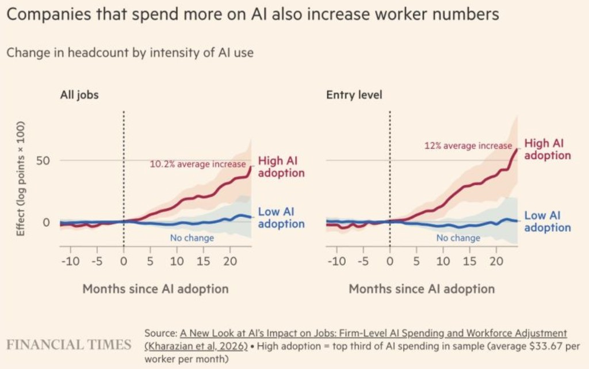

Companies spending the most on AI are actually hiring more people, not fewer. Companies with low AI adoption are kinda stuck. In my experience talking to founders and interviewing at AI first companies, this tracks. They are genuinely more open to hiring early grads than traditional companies. The reasoning is simple. If you are building with AI from day one, you want people who grew up with these tools, not people who need to unlearn 15 years of habits. A new grad who has been prompting models since freshman year appears more valuable than a senior engineer who still thinks of AI as a fancy autocomplete.

When it comes to research startups (labs), they go two ways from what I have seen :
* Credentialmaxxers - hire PHDs, deepmind, FAIR, etc folk. High profile people. THey most probably wanna do novel pretraining architectures, new maths, you get the point.
* Rigourmaxxers - hire excellent engineers and hand them research problem and then pray to god. Nous Research literally started with a bunch of Discord buddies! Post-training, RL, envs, evals, harness, data pipelines, and more and mostly bound by experiments, not mathematical derivations. This throughput is kindof an engineering trait.

But the problem is, these AI first companies work you into the ground. The pace is relentless, they are tokenmaxxing to the moon. Ship fast, iterate faster, burn through problems at a rate that would make a traditional company's head spin. I have talked to friends at AI startups who describe it as exhilarating for the first six months and exhausting by month nine. The burnout rate is real. When every engineer is expected to do the work of three because AI is supposed to multiply their output, the pressure compounds. *You are not just competing with other engineers. You are competing with the theoretical version of yourself that the founders imagined when they said AI would 10x productivity.*

The tradeoff is stark. Traditional companies are not hiring new grads much. AI first companies are hiring them, but burning them out fast. Neither option is great. But at least with the AI first path, you are building skills that will matter in five years. The traditional path might be more sustainable, but good luck finding a traditional company that will take a chance on you right now.

Karpathy built a [US Job Market Visualizer](https://karpathy.ai/jobs/) scoring 342 occupations by AI exposure. Software developers score 9 out of 10. But a high score does not mean the job disappears. Demand could grow as each developer becomes more productive. The takeaway is not that software engineering is dying, its just being hit first. It is being reshaped faster than almost any other profession, i.e other crafts are gonna get hit soon as the tech matures (opportunity alert, CS + domain knowledge is gonna be lit, so take that EE, ME, BSBE, ES, pure sciences, and more cool things, dont be a CS maxxer). If you are not adapting, you are falling behind. If you are adapting, you are becoming more valuable than ever tbh.

They all want top-tier engineers. As per my observations, a good engineer :
* Uses AI to learn before going to a human. And ideally never needs to be taught the same thing twice
* Has an army of agents working for them day in day out
* Is a fucking skeptic, calling bullcrap your agent produces all the time. Fighting with your agent and refining outputs, thinking broadly
* Is accountable and cares about their work and takes initiative. Actually takes ownership of what they are doing, cuz agents will never do that. Attentiveness and curiosity to dig up issues before things ship to the user. They develop a feeling that something is off.
* Maybe a bit of an truly forward thinking elitist? 

Needless to say, the bar to hire is significantly higher. In my personal experience, its easier to get into big tech once you get the interviews, than top-tier startups (it my feel a bit weird, but startups are really unpredictable and T-shaped when it comes to interviews for hot roles). As I am joining startup, I will write about that. The keything is initiative. Founders dont look for people who need a lot of direction (and oversight) to be productive. They want hungry people (not 996) who have their eyes open and look for opportunities themselves to contribute and have an impact.

When it comes to senior people, I can see a lot of hiring of leadership roles in 2026 is :
* Trying to fix fundamental PMF lost in AI era. They are like, oh lord, please fix our company that is being fucked left right center in this AI era. Our top-tier talent are leaving. Please come and do the AI magic. Its all responsibilities with no ppower. And we can pay you the same as a Staff Engineer at Big Tech, but there is major upside if you literally fix everything single thing
* A much better option, please make our shitty wayy too much overvalued AI startup actually do real AI things. We never had a real Eng culture on the team. We raised at $1B valuation on $5M revenue with a Claude wrapper. We never had a real CTO or Eng team, just a 26 YOE founders, who was the only one of us who knew how to launch an EC2 instance. We can pay you the same as a Staff Engineer at Big Tech, but there’s an actual major upside if you literally fix everything.

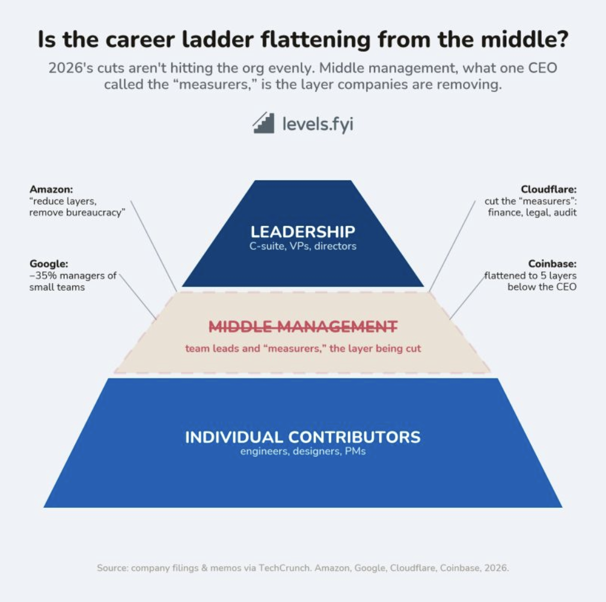

Middle management is the layer being removed first. Leadership stays. ICs stay. The middle gets squeezed out. If you are aiming for management, there are fewer rungs. If you are staying IC, the path is clearer. Companies need people who do the work more than people who measure it. Restructurings are narrowing focus onto fewer, higher leverage initiatives. The org is flattening and concentrating around the people who do the work.

### Performance is the only currency now

This is the market we are in. Years of experience no longer buy you seniority. Time in seat does not guarantee higher pay. Performance is the primary currency, and increasingly, it is the only one that matters.

On one end, a concentrated group of top performers are being paid extremely well to take on scope that previously required much larger teams. On the other end, many capable engineers are struggling to find roles at all, or to find a role that meaningfully exceeds their current compensation. The middle has thinned out. Average no longer clears the bar.

I talked to an AI engineer at a decacorn in San Francisco who said it is the greatest job market he has ever seen. The inbound top of the funnel is bonkers, and he finds himself saying no to places he would have once killed to work at. Meanwhile, a software engineer with 6 years of experience in London told me that as a developer without a specific specialization, he is struggling to get any interviews whatsoever. He spent a few years as frontend, then another few as backend, and most recently working on DevEx. In this market, he just does not get any callbacks for interviews, not even a first round.

You can see this shift clearly in how companies are redesigning incentives. Meta recently updated their performance system to allow top performers to earn bonuses worth up to 300 percent of their target. Google has made similar moves by increasing rewards for top ratings while compressing outcomes for the middle. Same level. Same role. Dramatically different outcomes based purely on impact. One good year does not cut it anymore. You have to prove yourself repeatedly.

The rise of PIPs as silent layoffs is part of this. Some managers are held to explicit PIP quotas, a required share of their team that must be on a plan regardless of actual performance. Even if their entire team is high performing, a percentage of employees have to be placed on a PIP. Thats shitty, but it is what it is.

Equity is reinforcing the same message. Front loaded vesting schedules went mainstream in 2025. A front loaded grant is 37.5 percent less equity in your offer letter for the same target total comp. Year 3 and 4 compensation drops significantly without strong refreshers. The companies are betting that you will earn your way to refreshers. If you do not, your comp falls off a cliff. You must verify refresher policies before accepting because they are now the primary engine for long term pay (and this thing is important in startups as well).

This org flattening has paved the way for a new kind of role, the Super IC. An individual contributor operating at a scope historically reserved for managers and directors. As AI collapses the coordination and work that previously required five or six specialists, a single capable engineer can now own an end to end product surface alone.

Layoffs are happening not because companies are weak financially, but because tolerance for low impact has collapsed. Cisco cut about 4000 jobs while reporting record Q3 revenue of 15.8 billion, up 12 percent year over year. Visa is cutting 7 percent of its workforce while the CEO cites real momentum and good financial results. Meta is printing money. Google is printing money. They are still cutting people. The cuts are not about survival. They are about concentration.

Levels were never truly tied to years of experience in the first place. Titles have always been about scope and influence, not tenure. But now the decoupling between experience, compensation, and seniority is unmistakable. A 25 year old Staff engineer at a hypergrowth company can out earn a 40 year old Senior engineer at a traditional company by 3x. The market does not care how long you have been doing this. It cares what you can do.

This is a winner take most market. It is brutal. It rewards the exceptional disproportionately and leaves little room for anything below that bar. If you are at the top of your game, have AI experience, and are senior enough, you can write your own ticket. If not, then the job market is tough. Referrals are a lifeline. It is impossible to get interviews for Staff or Principal Eng positions by cold applying as per the people I talked to. The only interviews people are getting from cold apply are Senior level roles.

One thing that became really clear to me in 2025 is that pay is no longer priced cleanly by title alone. It is increasingly priced by industry, by department, and by how much leverage a role actually has on the business.

Companies still use pay bands. That has not gone away. What has changed is how often those bands are being stretched, bent, or quietly ignored in specific pockets of the org. AI teams are the clearest example. We have all seen the headlines about million dollar sign on bonuses and eye watering packages. But the more interesting part is why those numbers suddenly feel allowed. When a single model run costs tens of millions and infrastructure commitments reach into the hundreds of millions, the relative cost of an individual, even a very expensive one, starts to look almost trivial by comparison. In that context, salary caps get redefined.

That economic shift is cascading through how compensation decisions get made. Teams closer to core differentiation are getting more discretion. Offers are being shaped role by role, not just level by level. There is more flexibility in how cash, equity, and upside are traded off depending on the person and the urgency. A lot of this is not formalized. It happens as exceptions. But when enough exceptions pile up, they stop being edge cases and start becoming the new reality.

You can also see this in the rise of roles like Forward Deployed Engineers. These are not just engineers, and they are not just go to market. They sit right at the intersection of product, customers, and revenue, and they can materially change outcomes. FDE job postings surged 800 percent between January and September 2025. One engineer owns the entire customer relationship from first call to production deployment. They combine software engineer, solutions architect, consultant, and startup CTO into one role.

Layer on top of that the quiet golden handcuffs effect from the last few years. Many senior engineers who joined during the 2021 to 2022 window are sitting on massively appreciated equity and simply cannot be matched by today's market unless the role is AI critical.

The trap is that refresh grants reset the handcuff clock. Accepting new 4 year grants means the handcuffs never fully release. Ask for a mix of cash sign on to cover near term loss and new RSUs to replace long term equity. Know the new employer's cliff structure because a 1 year cliff creates a compensation gap.

So high impact talent stays put, lower paid roles churn more, and movement becomes uneven. That dynamic is reinforcing specialization even further.

The tech sector, which built its global dominance on hiring smartass 22 year old kids and betting on their trajectory, has retired that playboo i guess. Top CS grads in 2025 are twice as likely to call themselves a founder compared to the 2022 class, and 45 percent less likely to land a job at a major tech company. Whatever comes next will be built largely by the generation that managed to cross the threshold before the door slammed shut on their faces.

Stepping back and reflecting now at the start of 2026, this feels like a real inflection point. Compensation is no longer just a function of level, title, or geography. It is increasingly a function of how capital intensive your company is, how scarce the talent is, and how much leverage a single individual can exert on that capital.

## LUCK and its anti

Try to make yourself more lucky. Have high AGENCY. Just be bad at making excuses, there are no ends to buts in life. Just get what you want out of life. Intensity at right times have exponential value. An underrated aspect of hardwork is that it induces trust before results. Reliability as a human being goes a long way. You can engineer luck sometimes. Everybody at the end has is a salesperson. We are just selling different things. Its the magnitude of achievements that matter more than frequency of achievements, so take those audacious projects.

But i cant neglect that there is bad luck as well. Its when you are doing everything right, but getting dragged out due to factors beyond your control. This is most common in 2026. People complanining about no luck factor are sitting at 0, which is atleast better than bad luck. 

After Meta layoofs, zuck apologized, but people pay with their lives. Losing their paycheck, healtcare, visa (lord help US immigrants), years of career momentum, etc. The leaders dont take accountability of their actions. [Meta is literally involved in child sexual abuse in India?!](https://www.nytimes.com/2026/07/07/world/asia/india-meta-child-abuse-imagery.html) No remorse I guess. 

### There are severe location advantages

The best job markets are generally in US/UK. If you are based out of New Zealand, its hard for you to land impactful roles. Immigration is a horrendous challenge in 2026! For example, if you are in Swiss studying in ETH Zurich, there are strict laws for remote work (given you wanna work at US/UK based firms are there are comparatively less companies in swiss). So, if possible, stay in US/UK/Europe to maximize your opportunity surface area. India also has a really nice job market for SWE at the top of the hierarchy. 

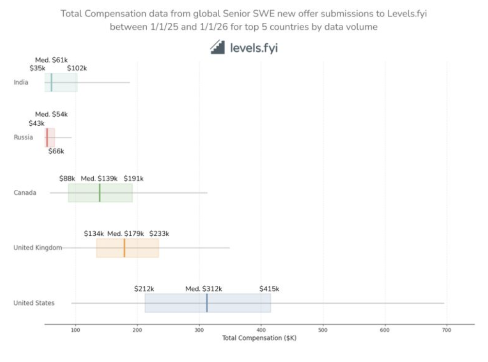

The numbers are stark. A senior software engineer in the US earns a median of 312K. In the UK it is 179K. Canada is 139K. India is 61K. Russia is 54K. The US pays nearly twice what the UK pays and five times what India pays for the same job title.

But the ranges tell a more interesting story. The US has the widest spread, from 212K at the low end to 415K at the high end. That 200K range reflects the difference between a senior engineer at a mid tier company versus one at a top paying firm with strong equity. The UK range is 134K to 233K. Still meaningful variation, but the ceiling is much lower. India ranges from 35K to 102K, which means the top Indian offers are still below the bottom US offers.

This is why immigration matters so much for compensation. An engineer who moves from India to the US can triple their compensation overnight. The same skills, the same work, wildly different outcomes based purely on geography. The reverse is also true. A US engineer who moves to the UK takes a 40 percent pay cut at the median. Some people make that trade deliberately for quality of life, visa simplicity, or personal reasons. But it is a real financial cost.

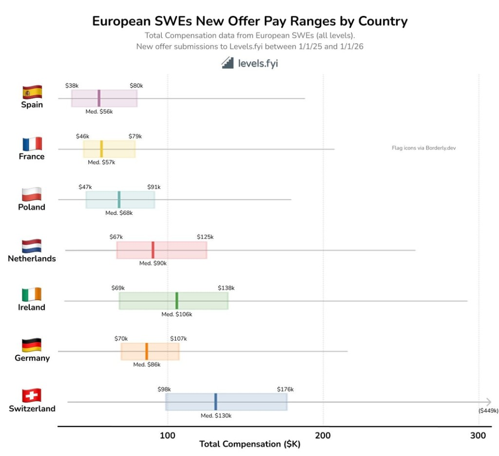

If you are considering Europe, the compensation landscape varies wildly by country. Switzerland and Spain sit at opposite ends of the spectrum. Swiss engineers earn about 3x what Spanish engineers earn at the median. Switzerland at 130K median, Spain at 56K. But once you factor in cost of living, the gap is not so straightforward.

Zurich routinely ranks among the most expensive cities in the world. Overall costs are roughly 50 percent higher than Madrid. Housing costs are often more than double. A one bedroom apartment in Zurich runs 2000 to 2800 dollars per month. In Madrid, the same apartment is around 1260 dollars. Higher pay in Switzerland often needs to stretch much further just to reach a similar standard of living.

Here is the counterintuitive part. When you look at actual free cash after rent and essentials, the picture flips. A Warsaw engineer earning 60K keeps about 2850 euros per month after rent. A Dublin engineer earning 85K keeps only 1430 euros. Dublin is a trap at median senior levels. The rent eats everything. It only works if you are at FAANG equity ranges. Romania is even more extreme. A senior engineer in Bucharest saves about 40K euros per year on a 100K salary. That is the same absolute savings as a Swiss engineer on 140K. Tax and living costs move take home as much as headline pay.

Ireland and Netherlands sit in an interesting middle ground. Ireland at 106K median, Netherlands at 90K. Both have strong tech scenes with major companies having European headquarters there. But the Netherlands has a secret weapon called the 30 percent ruling. If you qualify as a skilled migrant, 30 percent of your salary is tax free for five years. Without it, Berlin beats Amsterdam on the same salary level. With it, Amsterdam becomes one of the best options in Western Europe.

Germany at 86K median is surprisingly lower than you might expect given its economic size, but the cost of living in Berlin is also lower than London or Zurich. Berlin has the deepest tech ecosystem in continental Europe. Poland at 68K median is emerging as a strong option for engineers who want European quality of life at lower costs. The B2B contractor model in Poland drops effective tax to 10 to 15 percent compared to 38 to 42 percent as an employee in Germany. Same work, dramatically different outcome.

Spain has its own tax hack called the Beckham Law. If you move to Spain as a foreign worker, you pay a flat 24 percent tax rate for six years instead of the progressive rates that can hit 45 percent. Portugal has the IFICI regime with a 20 percent flat rate for ten years. These schemes exist because European countries are competing for tech talent and they know headline salary is not the only lever.

The UK is notably absent from this chart, but London remains the largest tech hub in Europe by headcount. Compensation there tends to be higher than most of continental Europe but still significantly below US levels. The tradeoff is access to a massive job market with lots of options. One quirk of UK taxes is the 60 percent effective marginal rate on income between 100K and 125K pounds due to the personal allowance taper. If you are negotiating a UK offer in that range, push for equity or pension contributions instead of cash.

The geo arbitrage play is obvious. Earn a Western European or US remote salary while living in Warsaw, Lisbon, or Bucharest. You can save 50 to 70 percent of your income. But this window is closing. Remote friendly companies increasingly detect the arbitrage and rebalance salary bands. Meta, Google, and EU scale ups have been doing this since 2023. If you are getting HQ rate in a lower cost city, it is a 2 to 3 year window before the formula catches up. Save aggressively.

For me, joining Sqwish AI in the UK made sense because of the EMI tax benefits I mentioned earlier, the access to the London tech ecosystem, and the fact that early stage startups in the UK can offer competitive packages when you factor in the equity upside. The nominal salary might be lower than a US offer, but the tax treatment on equity is genuinely better. And being in London means I am in the same timezone as most of Europe, which matters for an early stage company building relationships across the continent.

### The remote work problem

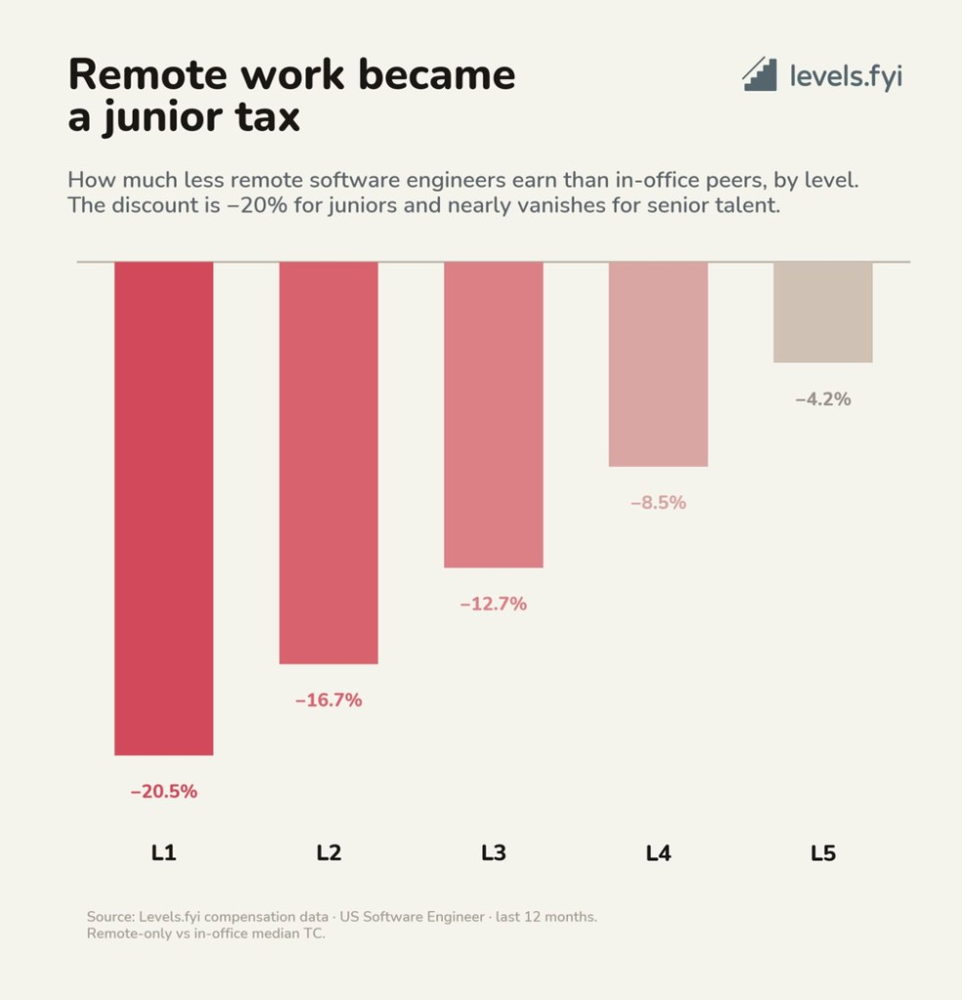

I decided to join onsite for a reason. There is a price to working remotely, and that price is not the same at every level.

At L1, remote engineers earn about 20 percent less than their in office peers. At L2 it drops to 17 percent. By L3 it is 13 percent. By the time you hit L5, the gap has compressed to just 4 percent. The discount shrinks almost perfectly as you gain seniority.

This pattern tells you something about how companies think about junior engineers. When you are early in your career, you are harder to evaluate without in person signals. Your output is more tied to your environment. Mentorship happens through osmosis, watching how senior people behave, how they handle meetings, how they debug problems, how they navigate politics. That kind of learning does not transfer well over Zoom. Companies price that uncertainty into your compensation.

The data on promotions is even more stark. Fully remote workers get promoted 31 to 35 percent less frequently than in office peers. But here is the interesting part. Hybrid workers who come in 2 to 3 days a week show no promotion penalty at all. The penalty is specific to fully remote, not to flexibility in general.

A study of software engineers at a Fortune 500 company found that engineers sitting near their teammates received 22 percent more code feedback than those in different buildings. When offices closed during COVID, that advantage disappeared. The feedback was primarily received by junior engineers and given by senior engineers. Proximity creates mentorship whether you plan for it or not.

There is a tradeoff here that nobody talks about. Mentorship is not free. When senior engineers mentor juniors, their own output drops by about 23 percent. They are spending time teaching instead of coding. Remote work lets senior engineers focus on their own output, which boosts productivity today. But it sacrifices productivity tomorrow because junior engineers develop fewer skills.

The career advice buried in this is simple. Early on, being in office is not just a financial decision. It is a compounding one. You close the pay gap, but you also get faster feedback, proximity to key people, and the kind of informal learning that accelerates careers in ways that do not show up on any spreadsheet. In office workers spend 25 percent more time on career development than remote counterparts. 40 more minutes per week mentoring, 25 more in formal training. That compounds into a gap that does not show up on a CV but shows up everywhere else.

Once you are senior, the calculus shifts. Your leverage becomes portable. You have a track record, established relationships, and work that speaks for itself regardless of where you sit. The remote discount shrinks to noise, and flexibility becomes a real option without meaningful sacrifice.

The consensus from people who study this stuff is that the first 2 to 3 years of your career are the period of maximum tacit knowledge acquisition. This is when you are building your fundamental mental models of how work happens. Fully remote during this window is a genuine disadvantage. Hybrid is fine. Fully remote is risky.

There is also something called the scarring effect that researchers are starting to document. In jobs that can be done remotely, young college graduates have persistently elevated unemployment compared to older graduates. This pattern does not exist in jobs that cannot be done remotely. The implication is that remote work may be causing permanent damage to an entire cohort's career trajectories. Companies are not hiring juniors remotely because training them remotely is genuinely harder and riskier. One recruiter told a story about a Houston health tech client that waited 8 months for a junior platform hire at 108K, then rescoped to mid level at 142K and closed in 3 weeks. The cheaper on paper junior turned out to be the most expensive option.

The leverage has also shifted dramatically. In January 2025, 51 percent of employees said they would quit over return to office mandates. By mid 2026, that number dropped to 7 percent. Remote work is now a negotiated privilege, not a right. 44 percent of workers believe at least half of US companies will have eliminated remote work entirely by end of 2026.

## Interviewing
When you interview as a new grad, you don't have much leverage, unfortunately. Most of the time, you will be lowballed. Even if you have a lot of internships and very good work experience, it's not really considered very seriously. As a new grad, I have given:
- data structures and algorithms round (leetcode, and sometimes random applied algorithm)
- low-level design rounds
- high-level design rounds
- ML rounds
- AI engineering rounds
- math puzzles, probabilities, and statistics

For big tech, they still care about DSA rounds. For startups, its LLD + HLD thats most common. 

I have literally built god knows what, 10,000 queries per second level distributed systems, agent sandboxing, more in a bloody 45-minute interview. How well you perform in those interviews is simply not the only factor when deciding whether to give you an offer or not. It is also dependent upon other factors which are not controlled by you. There is always somebody who is willing to work for less money than you are. There might be somebody who has one specific experience and one specific thing that the company wants, which you don't have. There could be a thing where the company has a bias towards graduates of a certain university compared to other universities. There could be a plethora of things that could make them reject you for someone else, even if you are really, really good. There is a lot of luck involved, whether you like it or not. 

Almost all the hiring managers, the founders, CEOs, and CTOs shout out of their lungs that they want the best talent, that they want the smartest people, the top 1% of engineers and whatnot. To be very frank and very honest, most of these people themselves are not that smart, they are very normal people with a lot of privilege and the right place at the right time effect. I don't know why software engineering has such ego issues. I know some guys in aerospace and some biotech folks who are extremely competent (they are translating signals from brains to help patients speak, truly noble use of AI), but you will never see them speaking such bullshit with such deep confidence. I guess its VC language. I have talked to people who consider themselves humble, which is paradoxical as a truly humble individual simply cannot internalize that they are humble, otherwise humility will become another garden that ego waters, and indeed a beautiful looking garden it would be.

## The research scientist premium

I have a few friends who finished their PhDs recently. One of them walked into an industry job with zero prior work experience and started earning what I would make after 5 years as a software engineer. No internships, no industry connections, just a dissertation and some papers. That blew my mind when I first heard it.

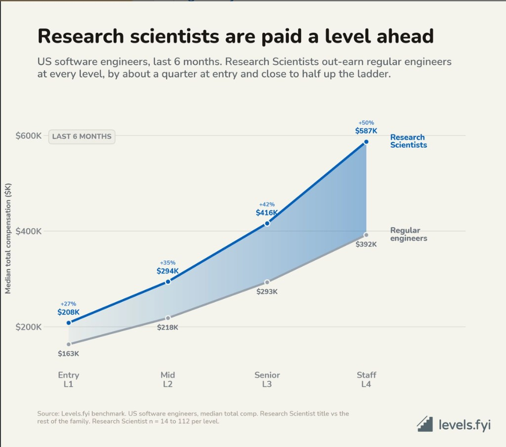

The role is Research Engineers/Scientist. A few years back, almost nobody outside of academia knew what this job was (I leterally knew only some REs in UCL who do cool physics). Now every AI company is fighting over these people like they are the last engineers on earth.

What changed? The product changed. When the model is the product, the people who can make the model better become the most valuable people in the building. It is not about shipping features anymore. It is about whether your model can do something it could not do last month. The researchers who can push that boundary went from being a nice to have to being the entire competitive advantage.

A software engineer ships the app. A research scientist invents the thing that makes the app possible. They are the ones designing new architectures, figuring out why training is unstable, running experiments that take weeks to complete. Most of them have PhDs. Their job is to create capabilities that did not exist before, then hand those capabilities to the engineers who productionize them.

The pay reflects this. Look at the chart. At every level, research scientists earn more than software engineers. A fresh PhD with no industry experience starts around 208K. That is roughly what a mid level software engineer makes. By the time you get to senior levels, the gap is even wider. Research scientists are basically paid a level ahead from day one.

Why so much? Two reasons. First, there are almost no people who can do this work. The pool of humans who can genuinely push the frontier on foundation models is measured in thousands globally. Maybe a few hundred at the very top. And every major lab is trying to hire from that same tiny pool. Anthropic, OpenAI, DeepMind, Meta AI. They are all bidding against each other for the same people.

Second, the upside is asymmetric. If a researcher figures out the next big training trick or architecture improvement, that discovery gets baked into every product the company ships. One breakthrough can be worth billions in market value. Companies will pay absurd premiums for even a small chance at that kind of outcome. Hiring engineers scales linearly. Hiring researchers is a bet on exponential returns.

The numbers at the top are fuck you money. Senior researchers at frontier labs pull 400K to 700K in base salary alone. Total comp with equity runs 700K to 2M. Staff and principal levels can hit 2 to 5M. There are stories of labs offering nine figure packages to poach top talent. Most of those headline numbers are multi year performance vesting deals for a handful of very senior people, not upfront cash. But even the standard signing bonus for a senior researcher poach is 300K to 500K. That is still insane by any normal measure.

The traditional path is a strong PhD plus internships at top labs, then a research scientist offer at graduation. Takes about 5 to 7 years from undergrad. There is also a second path where you start as a research engineer, which is more engineering focused, and transition to research scientist after a few years of strong contributions. That transition often happens informally, a tap on the shoulder rather than a formal application.

Here is something that surprised me though. Anthropic says about half their technical staff have PhDs, but plenty of brilliant colleagues never went to college. The PhD is not strictly required. What matters is whether you can do original research. If you have a strong public portfolio, open source work that gets cited, papers you published independently, that can substitute for formal credentials. The PhD signals capacity for self directed research over long time horizons. If you can demonstrate that capacity another way, the door is not closed.

One misconception I had was that research is purely theoretical. In 2026, frontier AI research is heavily empirical. You are not sitting in a room with a whiteboard deriving equations. You are running experiments on thousands of GPUs, debugging distributed training, iterating on ideas that might take weeks to validate. The line between research and engineering has blurred a lot.

For my research friends still in academia or thinking about industry, this is probably the best time to make the jump. The premium for research talent has never been higher. But I am not sure the window stays open forever. Once foundation models mature and the field shifts from capability research to deployment and optimization, the balance might shift back toward engineers. Right now though, if you can do the work, the market will pay you like it.

But keep in mind, [an academic brain is quite different from a founder's brain and the transition is quite challenging](tab:https://fchaubard.github.io/academic_brain_vs_founder_brain.html).

## New unicorn FDEs

One AI company builds forward deployed engineering and then everyone decides they need an FDE team too. Forward deployed engineering works when your contracts are seven figures and integration takes 6+ months. It's unlikely a fit it you're selling a product at $20/month.

And all the best to people hiring FDEs! The overlap between a great engineer and someone you’d confidently put in front of a customer is too small. The tech worlds hottest new role is hardest to hire. There interview process is beyond broken.

## The people who never left

Everyone tells you to job hop. The conventional wisdom is clear. Switch every two or three years, collect a raise, rinse and repeat. I have heard this advice a hundred times.

But something interesting happened recently. The job hopper premium is vanishing. In 2022, during the Great Resignation, switchers were seeing nearly 18 percent more wage growth than people who stayed put. By early 2026, that gap collapsed to almost nothing. In some industries, stayers actually outperformed hoppers. The math isnt mathingg. This got me thinking about the people who never played that game at all. The engineers who spent 10, 20, 30 years at a single company. Some of them have been at their company longer than my entire existence. In an industry where two years feels like a long time, these people are outliers.

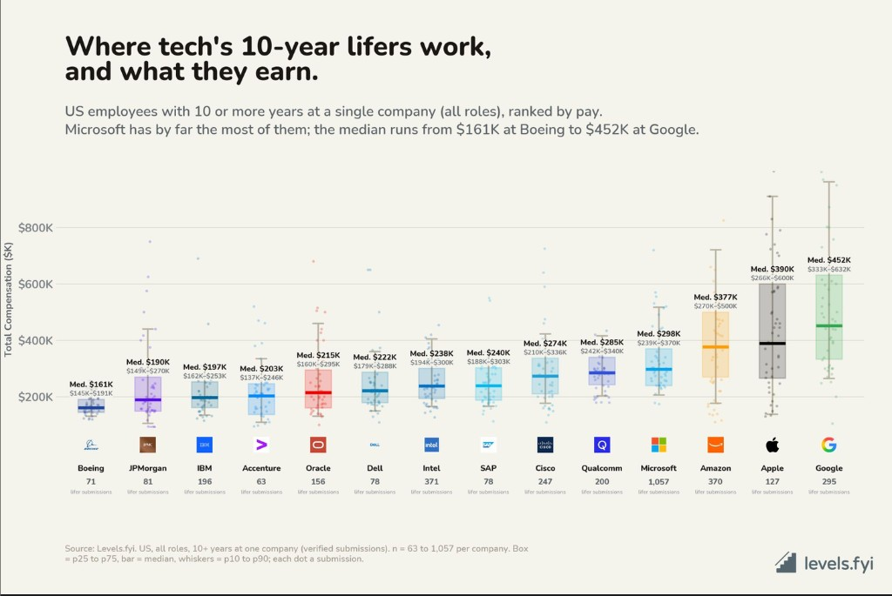

Microsoft has the most of them. Over a thousand engineers with a decade or more at the company. Amazon has a few hundred. Google has a few hundred. Apple has around a hundred. But what that loyalty pays depends entirely on where you stayed.

Someone who spent a decade at Boeing earns around 161K. Someone who spent a decade at Google earns closer to 452K. Nearly three times the compensation for making the same choice. Same commitment, wildly different outcomes.

Why does the gap exist? It comes back to equity again. Google and Apple load compensation with stock that actually appreciates. Someone who joined Google in 2014 has watched their RSUs multiply as the stock climbed. A Boeing lifer gets a pension and maybe some restricted stock that barely moves. The compounding works in opposite directions over a decade.

But I want to be fair here. The headline numbers miss things. Boeing offers a 75 percent 401k match up to 8 percent of salary, plus pension plans, plus genuine job stability. An engineer who maxes that match is getting an extra 6 percent of salary in retirement contributions that never shows up in total comp figures. The defense contractor trade off is lower headline numbers but better benefits and work life balance. 40 to 45 hours a week instead of the 55 to 65 you might work at a high growth startup. That is a real choice some people make deliberately. Not everyone optimizes for the biggest number on a spreadsheet.

The other factor is refresh grants. At Google and Meta, annual refreshers stack on top of your initial grant. By year 10, you might have 7 or 8 overlapping grants vesting simultaneously. At traditional companies, you get your initial grant and maybe a small annual bump. The equity machine that makes Big Tech compensation so high also rewards tenure in ways that defense contractors simply cannot match.

This creates what I have heard people call rolling handcuffs. You get hired with a 4 year grant. In year 2, you get a refresh with its own 4 year schedule. By year 4, when your original grant finishes vesting, the refresh still has 2 years left. And you got another refresh in year 3 and year 4. The handcuffs never fully release. There is never a clean time to leave. Almost half of employees on Blind say unvested equity is their number one reason for not leaving. The companies designed it this way on purpose.

The real cost of leaving is also not what you think. RSUs are taxed as ordinary income at vesting. In California, your effective rate on RSU income approaches 52 to 53 percent. That 400K in unvested equity headline number might be worth 190K after tax. When you negotiate with a new employer, present your exact vesting schedule, not a total dollar amount. Ask for a mix of cash sign on to cover near term loss and new RSUs to replace long term equity. Know the new employer's cliff structure because a 1 year cliff creates a compensation gap.

But here is what fascinates me. There is a software engineer who has spent 35 years at NASA's Jet Propulsion Laboratory in Pasadena. One of a small group of JPL engineers who simply never left. Still writing code that controls spacecraft. There are people like this scattered everywhere the spotlight does not reach. Decades long careers in CERN, aerospace factory floors, at research labs, at universities and small town employers. People who found something worth staying for and never looked back. For some reason, these people are mostly engineers or computational scientists (these people are gonna be in huge fucking demand).

There is also something job hoppers rarely acknowledge. You can learn the basics of a codebase in year one. You become competent. In year two, you start understanding why things were built the way they were. But real expertise, the kind where you can anticipate problems before they happen and shape the direction of a product, that takes year three and beyond. I have talked to senior engineers who say they can tell within 30 minutes whether someone (me) has surface level knowledge or genuine depth (I was assessed as T-shaped and thats a nice thing to know). Job hoppers often have breadth without depth. They know a bit about many things but have not truly mastered anything. That intuition, that judgment, it gets built over years of staying and going deep.

I am not saying everyone should stay forever obviously. Even CEOs and CTOs change. Strategic movement still pays, especially early in your career when you are building skills and finding your niche. But somewhere along the way, for some people, the calculus changes. The next rung on the ladder matters less than the work itself. The JPL engineer writing code that leaves the planet probably does not care that a Google engineer makes three times more. They are doing something that matters to them in a way that no salary can replace.

When I was deciding between offers, I thought about this a lot. I took a pay cut to join Sqwish AI in the UK. I am not even sure whether we will survive beyond 2 years. But I wanted to be somewhere I could go deep, build something meaningful, and actually see the impact of my work. Maybe in 10 years I will be one of those lifers. Or maybe I will have moved on. But I wanted to at least give myself the chance to find out what staying feels like.

### Years of experience is not what you think

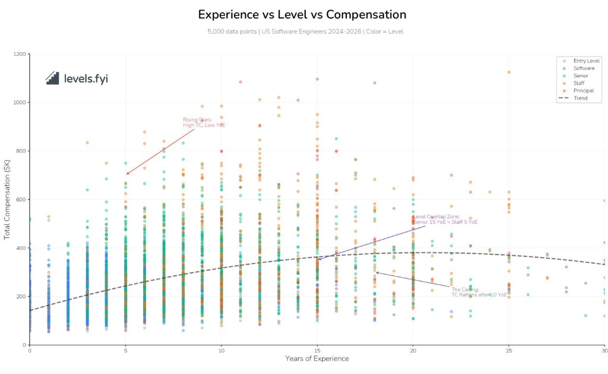

Look at the rising stars zone. Engineers with just 5 to 7 years of experience hitting 700K to 900K at Staff and Principal levels. Then look at the overlap zone. A Senior engineer with 15 years of experience earning less than a Staff engineer with 5. Same industry same job family but wildly different outcomes.

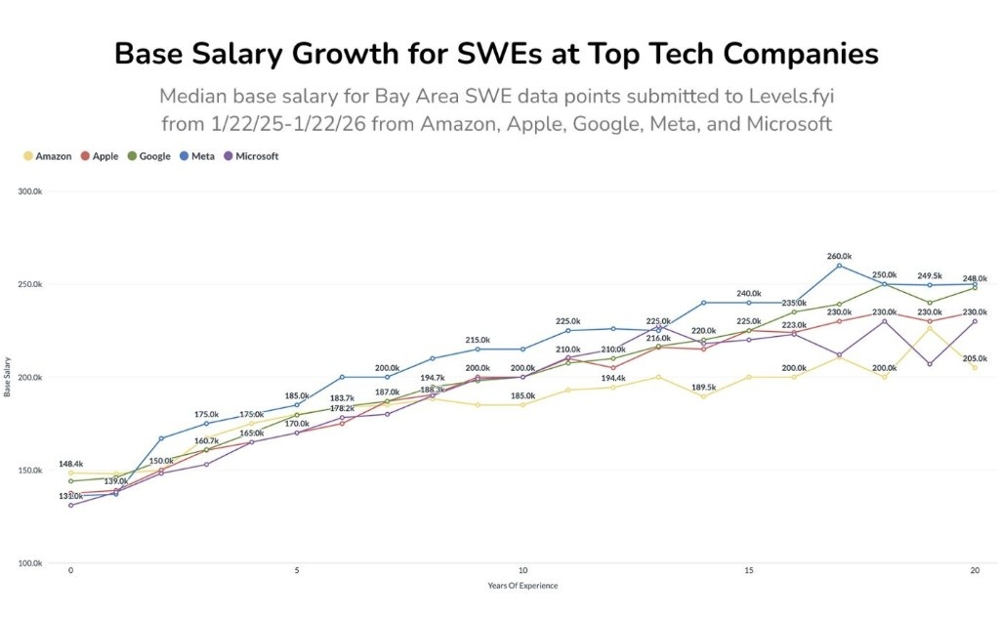

base salary tells a different story. Look at how the lines converge. At year zero, there is a 15K spread between the highest and lowest paying company. Amazon starts at 131K, Apple at 148K. By year 10, the spread has widened to about 40K but the trajectories are remarkably similar. All five companies follow nearly the same curve. The real divergence happens after year 15 where Meta pulls ahead to 260K while Microsoft and Amazon flatten around 230K.

What strikes me is how predictable base salary growth is compared to total compensation. Base salary at these companies grows roughly 5 to 7 percent per year for the first decade, then flattens. The curve looks almost identical across Amazon, Apple, Google, Meta, and Microsoft. This is not a coincidence. These companies benchmark against each other constantly. They know exactly what the others pay and they stay within a tight band.

The implication is that if you are optimizing for base salary alone, it almost does not matter which of these companies you join. The differences are noise. The real compensation divergence comes from equity, and equity is where level matters far more than tenure. A Staff engineer at year 7 will out earn a Senior engineer at year 15 because the equity multiplier at Staff is so much higher. The base salary chart shows parallel lines. The total compensation chart shows exponential divergence based on level.

Years of experience can be a useful proxy in aggregate. More time usually means more scope, more projects, more reps. But it is not prescriptive. The rising stars often joined hypergrowth companies early (note this), made big bets on hard problems (be audacious), or optimized for trajectory over comfort. The late bloomers might have spent years in slower moving industries, taken way too much linear paths, or prioritized factors beyond compensation (like WLB to the moon).

Compensation flattens after about 10 years of experience. After that, level is what moves the needle, not tenure. You can have 20 years of experience and earn less than someone with 7 if they made Staff and you stayed Senior. The market does not pay for time served. It pays for scope and impact.

85 to 90 percent of engineers plateau at Senior. L4 is terminal at Google, you don't really need to get promoted. Not from lack of ability, but from limited Staff positions, different skills required, and work many engineers simply do not want to do. Senior is terminal at most companies. You can stay there indefinitely with satisfactory performance. Staff roles are scarce. Senior engineer submissions outnumber staff submissions roughly 3 to 1 on compensation sites.

The Senior to Staff jump is the largest single compensation increase after you hit Senior. At some companies it is 30 to 50 percent. But the jump requires fundamentally different work. A senior engineer is paid to deliver. A staff engineer is paid to make other people's delivery better. That is a different skill that does not automatically arrive with more years of shipping features. It's something you have to actively squire.

The rising stars understood this. They performed Staff level work before requesting the title. They identified cross team problems and authored technical strategy documents. They mentored senior peers and created paved roads that improved developer efficiency. They switched companies strategically to get leveled up at hiring, which is the highest leverage negotiation move. They did not wait to be promoted. They demonstrated Staff level impact first.

This is why I think the obsession with years of experience in job postings is mostly noise. What matters is what you did with those years. Did you ship things that mattered? Did you grow your scope? Did you take on harder problems? Two engineers with the same YoE can have completely different trajectories depending on the choices they made along the way.

## Startups vs BigTech

**With gauranteed higher risk, comes potential higher reward. (⌐ ͡■ ͜ʖ ͡■)**

If someday you think you want to do a startup, then join one sometime in your career. The 0->1 exp of starting from scratch and building something and then seeing customers use it, to scaling it, that experience is valuable. tbh, if you can be part of early founding team (before 5-10 customers), the amount of freedom and thrill will make you crazy. Its fucking spiritual. And if that company is what you think excites you (what people call true calling), then it will make you personally very happy.

I see a lot of very good eng leaders doing their own company, as its easier than before now. They have core team in US, raise funds there, and often hire in other tech hubs.

Dont join a startup for money. You are much more likey to make better money at a larger company, doing 9-to-5 at already proven product.

When they join their lovely startup, initially things look fine, but later they are pushed to do 996 for meager equity. Not everyone can sustain that (especially when you are managing your house yourself, have family responsibilities, are senior, etc you get the point). The only things that a startup kinda guarantees is growth. Thats why the startup buzz is about that. There are no other promises. But you can get that growth in a big company in the right team as well. So, a startup is all about the founder, and your confidence in them. Startups are difficult. ESOP are paper money, and most probably will be nothing. But there are things beyond money in careers that compound better. **As an engineer/researcher, you are the culmination of hardest problems you have tackled in your career.**

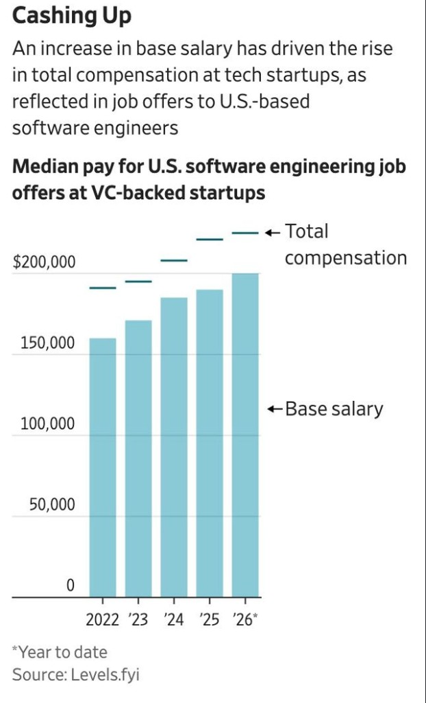

But here is the thing that has changed. The old startup deal was straightforward. Take a lower base salary, bet on equity, hope for an IPO or aquisition. That tradeoff made sense when startups could not compete on cash. Now they can and most probably they will overpay to get top talent. The driving force is a collision of massive VC funding and an extremely thin talent pool at the top. The top 5 to 10 percent of candidates are the ones commanding all the offers while everyone else struggles. **It is a candidate's market at the top and an employer's market at the bottom.** It contradictory but Layoffs and hiring surges are happening simultaneously in the same industry. It is two completely different economies sharing the same job board. These startups are staying lean, so every hire needs to be exceptional, and exceptional people have leverage, a lot of levrage. I can tell you first hand, its really hard to hire, like you have to more really fast and wait, maybe borderline beg to get smart people. Until you are some Jeff Dean or something, its difficult. If you have the right skills, seniority does not matter as much as it used to.

The equity model is evolving too. Tender offers have become standard at most late stage private companies, giving employees liquidity years before an IPO. Some startups have eliminated vesting cliffs entirely, meaning employees own shares from day one. The whole take a pay cut and pray for an exit model is becoming outdated. Now you can get competitive cash and still have upside.

To thrive in the new world, you need AI-native experience. If you are not getting it, its career suicide according to me.

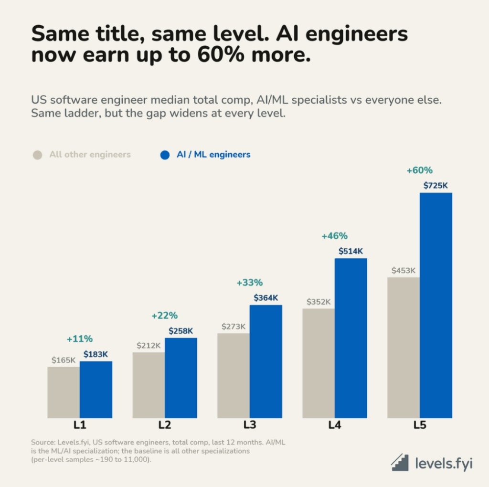

At least in 2026, a startup is more stable and gives more job security compared to big tech in my personal experience. Big Tech was for stability + brand on resume + learning on scale, but given how many layoffs and how much uncertainty have started to emerge in Big Tech, it's no longer the only thing that you should be considering at all. The best place to work these days is an AI research lab or something like that. It is better to work at Google DeepMind or Microsoft Research or some small AI lab (I kinda thing we are a underdog lab right now) than a company that is still working in the old ways and hiring software engineers and has rigid systems. Also, your big tech tag is not gonna help you much apart from resume screening if you didn't work on something that is worthwhile. I personally know people who just took Google's offer and worked with some goddamn Kotlin instead of taking an offer in a startup, which would have given them a very interesting agentic AI experience that is in much more demand right now. Quality of work really matters. You cant just live with a tag can you? Also, at higher levels, getting into big tech is less competitive (does not mean easier) than SDE-1s. Senior people are less willing to go through interview grinds. You wanna do leetcode instead of having good times with your wife?

I am not saying to go work at startups. There are [tradeoffs](https://danluu.com/startup-tradeoffs/). But there is no shame in doing that if your offer from Oracle got revoked suddenly. I know people laid of from Microsoft XBox team who are unwilling to work at startup whatsoever. They are kinda scared as they have never functioned in an env thats intense (MSFT used to be chill mostly, people would literally go there to retire). Its better to be employed, then take a stupid masters in US hoping that you will do better next time. Maybe you look desperate when you join startups, but indeed [startups are act of some desperation](https://blog.eladgil.com/p/startups-are-an-act-of-desperation).

## Too much talking

Dont believe in verbal confirmations, sweet talks, we are gonna be a generational company, we are elite and hire from MIT, Oxford, Harvard, IITs only (this is shit practice, dont be too proud over past achievements, there is only the present). I mean I am not joking every US founder repeats the same script, it's the same damn thing repeated over and over again. Understand what you are signing up for. Like genuinely, take time to understand. Its better that you intern at the company to see what there culture is actually like, and then sign full time offer if possible. This is hard and anxiety driven process, but read the shit paperwork that they are giving, and [ask howsoever stupid questions that you want to ask from them](https://jvns.ca/blog/2013/12/30/questions-im-asking-in-interviews/).

I know lot of junior and mid career people thinking stock options are gonna make them rich if they join Series A+. They are up for a rude awakening. Joining a startup (at any bloody stage) is like buying a lottery ticket (or even less, a scratch off ticker that you never really get to scratch). Those who join Series B+ are facing as much uncertainity as pre-seed employees in 2026. Joining at hypergrowth phase guarantees nothing. So, dont fall for the sweet talks.

### Everything is negotiable

Engineers with high perceived value make more than those with low perceived value. So, network (and write interesting blogs, so that people come into your emails and DMs offering you an interesting roles, not just Amazon HR DMs). People working in high-cost areas typically make more than people in low-cost areas. People who are [skilled in negotiation](https://www.kalzumeus.com/2012/01/23/salary-negotiation/) make more than those who are not. 

Overconfidence (not uncontrolled ego) is somewhat a virtue if used consciously. You can fall forward with it. Underconfidence will get you nowhere.

Now, practically, some companies want you to send them competing offer letters. They are shit HRs (or founders), and without second thought run in opposite direction, if possible. Some ask for previous salary slips to find out your market value. Ideally, you should not send them your competing offers. If they are from some famous companies like Coinbase, Google, etc they already know the numbers. But, if people are asking you to forward sensitive emails, you get the culture of the company. Look for better options.

## The equity game

This is a complex game, and lack of information here can mess you up.

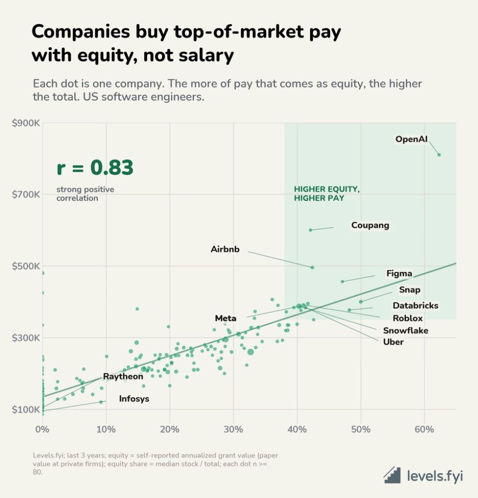

If you want to predict which companies pay the best, do not look at their salary bands. Look at how much of the package is stock. The relationship is surprisingly tight. Companies that pay mostly in cash cluster together in a narrow range. Companies that pay mostly in equity are the ones hitting the crazy numbers you see on compensation threads.

Why? Because cash is expensive in a way that stock is not. When a company pays you 200K in salary, that money leaves their bank account every two weeks. It shows up on the P&L immediately. There are pay equity reviews, salary band disclosures, and now transparency laws that force companies to justify big differences. You cannot hide a 2x pay gap in a salary band without someone asking questions.

Stock is different. When a company gives you 400K in RSUs over four years, they are not writing a check today. They are promising you shares that will vest later. It does not hit their cash flow until you actually sell. For a company trying to win talent without burning through runway, equity is the obvious lever to pull.

Think about the companies known for paying the most. OpenAI, Databricks, etc. They did not get there by offering 300K base salaries. They got there by offering 60 percent of the package as stock. OpenAI reportedly structures packages where equity is more than double the base salary. Databricks runs recurring tender offers so employees can actually get liquidity on their private stock. These companies figured out that if you want to pay at the 99th percentile, you do it with equity.

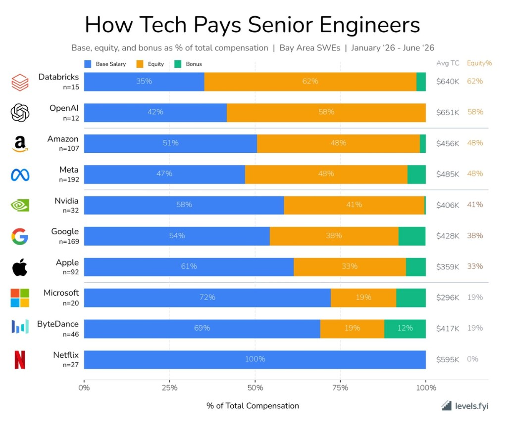

But here is the catch. Not every company can play this game. To offer equity heavy packages, you need a stock that engineers actually want. You need a growth story that makes waiting four years feel worth it. You need either a public market where shares are liquid, or a credible IPO path, or regular tender offers. The companies that can do this are usually the ones winning their markets. Which is why looking at equity share is a decent filter for finding the best places to work.

The companies stuck in the bottom left of that chart, traditional enterprises and defense contractors, are not there because they are cheap. They are there because they cannot credibly offer equity that anyone would value. A 0.01 percent stake in a company with no growth story is worth nothing in the minds of people. So they compete on base salary, which puts them in a narrow band, which means they can never reach the total comp numbers that equity heavy companies can.

This kindof creates a sorting mechanism. The engineers who understand equity and believe in a company's trajectory will take the equity heavy offer. The engineers who need cash now or do not trust the equity story will take the higher base offer. Neither is wrong at all, the startup person is trying to gamble. But the equity heavy path is where the outlier outcomes live, positive and mostly negative.

### The base rate most offer letters hide

Startup equity fails in a few predictable ways.

Most people never finish vesting. Leave before the four year cliff and schedule complete and unvested options vanish. That alone wipes out a huge share of packages before any exit happens.

Even vested options often die at the door. [Carta's compensation reports](https://carta.com/data/stock-options-math-2024/) track what departing employees actually do. In Q4 2024, workers exercised only 32.2% of vested in the money options, down from 54.2% three years earlier. [Carta's PTEP analysis](https://carta.com/learn/equity/leaving-company/post-termination-exercise-period/) found 82% of startups still use a 90 day post termination exercise window. Leave and you need cash for the strike plus taxes on stock you cannot sell. In their sample, the average employee who walked away left about $50,000 in vested options on the table. [Halle Tecco's essay on startup options](https://halletecco.substack.com/p/i-have-some-thoughts-about-stock) frames it as two gambles: a pay cut when you join, then a check when you leave to keep what you already earned.

Then there is the exit that pays everyone except you. Employees hold common stock. Investors hold preferred with liquidation preferences. [The National Association of Stock Plan Professionals](https://www.naspp.com/blog/Preferred-Shares-Common-Shares) explains the preference overhang. in many exits, preferred shareholders recover their investment before common sees a dollar. [Aption's breakdown of startup option payout rates](https://aption.com/blog/what-percentage-of-startup-options-pay-out) puts the chance of any payout above exercise cost and tax in the 5 to 20% range for venture backed grants.

| Exit price | Preference stack | What common might get |
| ---------: | ---------------: | --------------------: |
|       £25m |             £30m |              often £0 |
|       £50m |             £30m |                 ~£20m |
|      £100m |             £30m |                 ~£70m |
|      £500m |             £30m |        most of the £500m |

Your spreadsheet uses headline valuation times your percentage. The preference stack is what is left after investors get paid back first. [Marshall Hargrave's walkthrough](https://medium.com/startup-insider-edge/your-startup-equity-is-probably-worth-less-than-you-think-heres-the-math-cf7471f28669) and [this first person account of exercising startup options](https://www.productlessons.xyz/article/how-stock-options-for-employees-work) show the same gap, paper wealth at grant, then strike cost plus tax at exercise, then preferences at exit.

The board are the only people who decide what type of exit happens, and what employees get. reseach the board of the startup, i would say more than PMF! even if company does well, greedy board can prevent payout to people who do the real grunt work.

The founder will choose the board, so the ethics of founder is non negotiable. there are startups employees who found out that their founders made a special deal (secondary deal) where they got large perosonal payout while other employees get nothing (preference stack left nothing)

The grant also looks bigger than it is. Your strike price comes from a 409A valuation of common stock, not the preferred price from the last round. [Startup Law Blog's 409A guide](https://www.thestartuplawblog.com/409a-valuations-what-every-startup-needs-to-know/) and [409A valuation benchmarks](https://409a-valuation.com/insights/409a-vs-preferred-price) put typical common FMV at 25 to 60 percent below preferred, wider at seed and narrower pre IPO.

Zoom out to a career and it gets worse. [Wayne Morris modeled the odds](https://rvnu.substack.com/p/rvnu-030-the-startup-equity-reality) using NVCA venture monitor data, 10 4-year startup stints over 40 years gives roughly a 60 percent chance of never seeing a $100k+ equity payout, while below market salary traded for those options can easily total $400k in foregone cash. 

Looks pretty shitty if you are working for US-based startups tbh.

### UK EMI

If you are in the UK, read the grant anyway, but the tax mechanics are much kinder than US ISOs and NSOs ;)

[GOV.UK's EMI guide](https://www.gov.uk/tax-employee-share-schemes/enterprise-management-incentives-emis) and [HMRC's disqualifying event rules](https://www.gov.uk/hmrc-internal-manuals/employee-tax-advantaged-share-scheme-user-manual/etassum57050) are nice reads. with qualifying EMI options granted at market value, you generally pay no income tax or National Insurance on the gain at exercise. CGT applies on sale. Business Asset Disposal Relief can reduce the rate to 18% on qualifying gains as of April 2026. Unapproved options do not get that treatment (so remote workers in other countries are fucked).

From April 2026, [EMI limits expanded](https://www.gov.uk/hmrc-internal-manuals/employee-tax-advantaged-share-scheme-user-manual/etassum50500) up to 500 employees, £120m gross assets, and a 15 year exercise period for many companies. Leaving employment is still a disqualifying event with a 90 day window to preserve EMI tax treatment. That is a tax clock, not necessarily an exercise clock. Your plan may be exit only and give you zero days to exercise commercially even if HMRC gives you 90 days for tax purposes.

### Reading the grant before you sign

This applies whether you are in London or San Francisco. The paperwork matters more than the pitch deck.

Share count is not ownership percentage. Ten thousand options out of two million fully diluted shares is 0.50%. The same grant after a seed round that takes fully diluted shares to 2.7 million is about 0.37%. Ask for the cap table, issued shares, outstanding options, unallocated pool, SAFEs, convertibles, warrants, whatever.

Strike price is usually the easy part at early stage. The harder questions are scheme type, vesting, leaver language, and whether you can ever turn options into cash. Standard vesting is four years with a one year cliff. Founders on the same schedule is a good sign. You usually cannot rewrite the whole company EMI plan for yourself anyway.

Leaver clauses can bite like a bulldog. Good leaver keeps vested options with an exercise window. Bad leaver can forfeit even vested grants if the definitions are aggressive. Most seed stage UK EMI schemes are exit only, options vest on paper but you cannot exercise until acquisition, IPO, or winding up.

On acquisition, read whether the board may or shall accelerate unvested options. Neither helps if preferences eat the proceeds. Dilution is normal. Half a percent pre seed becoming about 0.37% post seed is common. Refresh grants at the next financing are the realistic path to rebuilding ownership if you become indispensable.

Exercise is not liquidity. [Carta's data](https://carta.com/data/startup-compensation-h2-2024/) also shows employee equity grants fell about 26% from late 2022 to 2023 and stayed flat while salaries rose, so headline grant sizes in older posts may not match what companies offer now.

Quick sanity check on the bet. Join seed stage on £65k with 25,000 EMI options over 0.3% fully diluted, four year vest, exit only. Investors put in £3m at 1x non participating. After two years half is vested. Company sells for £40m. Preferences take £3m first, £37m flows to common, your 0.3% is roughly £110k gross before strike and tax. Same grant at a £15m exit and preferences eat most of it. Same grant, no exit for twelve years, and options can expire worthless. That is the trade against a big tech salary with liquid RSUs.

If you do only three things, reconcile your percentage against a fully diluted cap table, model the preference stack at realistic exit prices, and understand leaver and exercise mechanics including whether the scheme is exit only. Ask whether the grant is EMI or unapproved, confirm grant date against any valuation expiry, and populate your prior inventions schedule if you have side projects worth excluding.

So when you are evaluating an offer, do not just look at the total comp number. Look at the mix. A 400K offer that is 60 percent equity is a very different bet than a 350K offer that is 80 percent cash. The first one is a bet on the company. The second one is a paycheck. Both are valid. But know which one you are taking.

## Me?

Personally, I had very competitive offers in India. I actually have taken a pay cut to join Sqwish in UK, that is the equity bet. I am not even sure whether we will survive beyond 2 years. Thats the difference that I myself will have to make. And I personally think, its an experience worth having. I will grow at the speed of light, will get opportunity to work with really really awesome people and shape culture of the company, and solve some really fucking hard technical problems. What else to ask for? The EMI scheme makes the tax situation much better than it would be in the US.

Choosing the right company is very important now, and its extremely hard as well. Its time to accelerate. We don't know what the next 6 months will look like, and I cant even imagine the next decade. Its a quantum leap that humans are going to make with AI. Just make sure you understand what trade off you are actually making.

## Relax 

At the end, to get hired, be that Waterloo guy (☝ ՞ਊ ՞)☝ 

and relax, take care of yourself. This is a bad time for most countires, let alone individuals. Thank god we are not in WW3 or something. Dont let go of your hobbies, travel time to time to relax, and live life. Its the only life that you have got. I know its easier said than done, but I am writing this for myself and you, and hopefully we both will succeed in our own ways. Jeff Dean used to be quite active while being a top-tier engineer.
