+++
title = "Grading Every Token"
date = 2026-10-07
draft = true
description = "A walk through on-policy distillation, OPSD, and SDPO: why a single reward paints every token the same color, and how a second prompt on the same model can grade the plus sign without grading the rest of the line."

[taxonomies]
tags = ["ml", "rl", "sdpo", "training", "llms"]
+++

Say the model is solving `3x + 7 = 22`. It moves the 7 across, forgets to flip the sign, and writes `3x = 22 + 7`. Everything after that is ordinary arithmetic, and it finishes at `x = 29/3`. The answer is 5, so the checker says wrong. Zero.

Most of what it wrote was fine. The bad token was the plus. The only signal that came back was one number for the whole attempt, and that number lands on every token, including `3x`, the equals sign, and `22`. This post is about getting a grade on every token, and about where that grade can come from: a bigger model, an answer key, an error message, and in the end the same weights reading the attempt again with extra text in the prompt.

The pictures are from a talk I put together on this. The argument is the same one I would give in a room: how a model writes, why GRPO is still the default, what on-policy distillation actually buys, and then the self-distillation methods that show up once you are already training the best model you have.

## How a model writes

A model writes one token at a time. At every step it puts a probability on every candidate next token and draws one. After `3x = 22` this one puts most of its mass on minus, which is the right continuation, and a fat chunk on plus. This time it drew the plus. That map, from "what is written so far" to a distribution over the next token, is the policy. Training decides, for each token the model actually wrote, whether that token should become more likely or less.

<figure class="diagram">
<a href="basics-next-token.svg">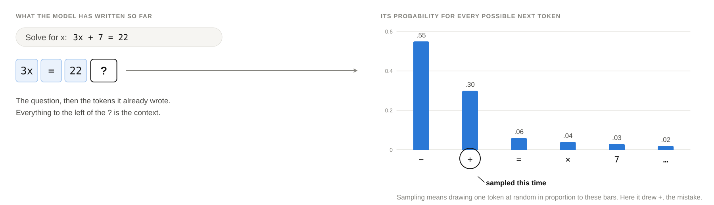</a>
</figure>

After pretraining there are two familiar ways to keep teaching it. You can show it good answers and have it copy them, which is supervised fine-tuning. Every token gets a target, and the text belongs to somebody else. DeepSeek's small R1 models are ordinary Qwen and Llama models fine-tuned on 800,000 answers written by R1. Or you can let the model try and grade the tries, which is reinforcement learning. The text is the model's own, and the grade is one number. R1-Zero was trained that way alone, rewarded only for a correct, well-formatted final answer.

Two pairs of words matter for the rest of this. On-policy means learning from text the model wrote itself. RL is on-policy, SFT is off the model's own distribution. Dense means a signal on every token. SFT is dense, outcome RL is sparse. Own text is where the mistakes you actually make show up. A per-token grade is what tells you which token was the mistake. The interesting corner is the one that has both.

## One number for the whole attempt

GRPO, the recipe DeepSeek made standard in [DeepSeekMath](https://arxiv.org/abs/2402.03300), makes that sparseness concrete. Sample a few attempts at the same question and score them. One of four succeeded, so the mean reward is 0.25. Our attempt scored 0, so its advantage, how much better or worse it did than its siblings, is −0.25. That −0.25 hangs under every token. The plus gets pushed down, and so do `3x`, `=`, and `22`.

<figure class="diagram">
<a href="grade-one.svg">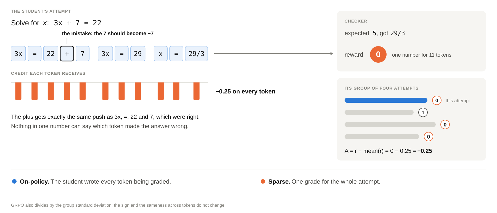</a>
</figure>

The update itself barely changes across this whole post. For each token, take the direction that makes it more likely, and multiply by an advantage. Every method below keeps that skeleton and changes what the multiplier is made of.

GRPO's version of the multiplier has three consequences I keep running into. One number is shared by every token, so a late mistake paints the opening. If the whole group passes or the whole group fails, the spread inside the group is zero and the batch teaches nothing. And every attempt has to be finished before it can be scored, which is a real cost once traces are tens of thousands of tokens.

PPO, the older version, also reweights each token by the ratio of its probability under the current policy to its probability under the policy that wrote it, and clips that ratio, classically around 0.8 to 1.2, so one update cannot run away. Remember that ratio. It comes back when the data is stale. PPO also trains a critic that tries to predict the final score from a half-written answer. That second network is expensive, and on long chain-of-thought it is often wrong, which is why GRPO dropped it and used the group mean instead.

So what do the labs actually run? I went through the recent technical reports, and GRPO, or something that is GRPO's idea with local patches, is still the chassis.

| model | what they say they run | what they plug in afterwards |
| --- | --- | --- |
| [DeepSeek-V4](https://arxiv.org/abs/2606.19348) preview, Apr 2026 | each domain specialist trained with GRPO | more than ten specialists merged by on-policy distillation, which replaced the combined RL stage |
| [Kimi K3](https://arxiv.org/abs/2607.24653), Jul 2026 | several attempts per problem, advantage = reward minus the group mean, plus their own loss and per-token masking for stale data | nine RL experts merged by on-policy distillation |
| [GLM-5](https://arxiv.org/abs/2602.15763), Feb 2026 | "builds upon GRPO", groups of 32, fully on-policy, masking tokens where training and inference disagree | earlier stages distilled back in on-policy |
| [Qwen3](https://arxiv.org/abs/2505.09388), May 2025 | GRPO on 3,995 checkable problems, then general RL | small models finished by on-policy distillation from the 32B and 235B |

OpenAI and Anthropic do not publish the algorithm. The gpt-oss card says they used similar chain-of-thought RL techniques as o3. Anthropic's system cards say RL from human and AI feedback, aligned to Claude's constitution. That is the public surface.

The reason it survives is pretty boring, in a good way. There is no critic: the group average does that job for free. Any reward plugs in, whether it is unit tests, an answer check, a rubric judge, or a pairwise comparison, because all of them collapse to a score per attempt. When something breaks, people patch it locally, with masking, clipping, or dropping the normalisation, and they keep the loop. And the thing the last column keeps showing is that the specialists then get merged with on-policy distillation, which is the same loop with a different advantage. That is the next part.

What GRPO still cannot say is which token was wrong, whether a batch where everything failed contained any information, or how to learn without finishing a 50,000-token proof.

## Dense grades, on somebody else's path

The other classic option is distillation. A small student learns to behave like a big teacher. The teacher writes, the student is scored on every token of that trace, and the feedback is dense. Then the student slips at step one. The training data only has the teacher's next line, which continues an answer the student is no longer writing. It never practised recovering from its own mistakes, so they compound.

<figure class="diagram">
<a href="grade-distill.svg">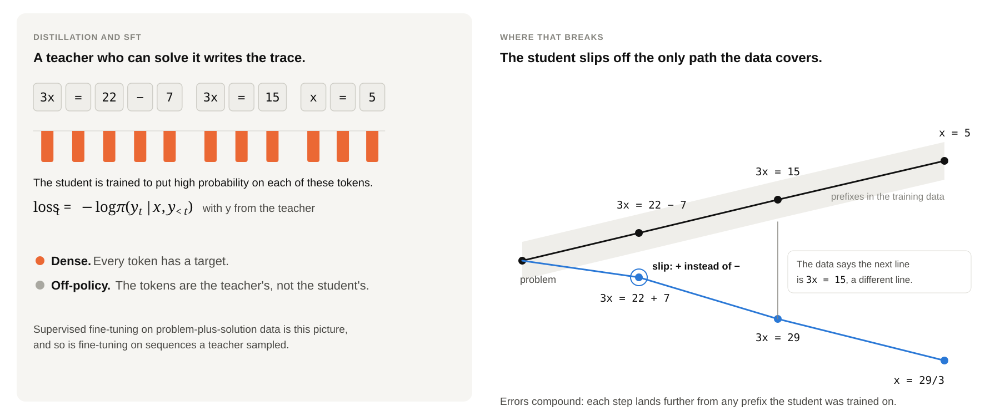</a>
</figure>

Two older ideas from distillation matter later. Match the teacher's probabilities, not only the word it happened to emit. If the teacher puts 45% on "so" and 43% on "thus", copying the chosen word treats "thus" as if it were as wrong as a plus sign. The full distribution keeps the ranking. Hinton called that dark knowledge. And a [2020 theory paper by Allen-Zhu and Li](https://arxiv.org/abs/2012.09816) is the reason a teacher that is literally the same network can still teach anything: two copies trained from different seeds learn different features, and distilling one into the other teaches the missing feature at the same size. If teacher and student are identical, including the prompt, the update is exactly zero. The extra has to come from somewhere. Later the teacher is the same weights, so the extra has to come from the prompt.

Put the two questions on a grid. Whose tokens, and how many grades. Copying is dense and off-policy. Outcome RL is sparse and on-policy. The empty corner, the student's own attempt with every token graded, is on-policy distillation. The [Thinking Machines](https://thinkingmachines.ai/blog/on-policy-distillation/) analogy is the one I actually remember: RL is playing chess and only hearing who won, copying is watching a grandmaster in positions you will never reach, and on-policy distillation is a coach grading every move of your own games.

<figure class="diagram">
<a href="grade-grid.svg">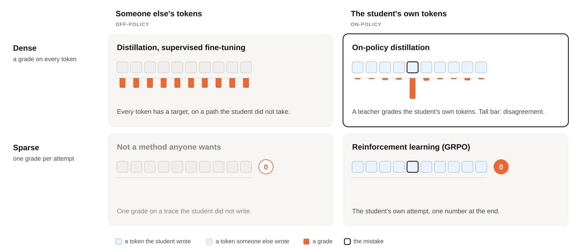</a>
</figure>

The cleanest evidence that "own attempts" matters this much is [Chu et al.](https://arxiv.org/abs/2501.17161), the "SFT memorizes, RL generalizes" paper. They post-trained one vision-language model two ways, copying or RL, then changed the rules at test time. In street navigation, training says "go north" and the test says "turn left". RL goes from 80.8 to 91.8. Copying collapses to 1.3. Copying memorised the answers. RL learned the rule. One detail I keep: their RL model saw the checker's message and could retry, and more retries transferred better. The text of the failure was already doing work. Ordinary RL just does not know how to read it.

## How much the teacher disagrees

Here is the core of the grade. The student writes. The teacher reads the same text and says how likely it would have been to write each token. The penalty on a token is the student's log probability minus the teacher's. Where they agree, the penalty is about zero. At the plus, the student is confident and the teacher is not, and the penalty sits on the mistake.

<figure class="diagram">
<a href="grade-token.svg">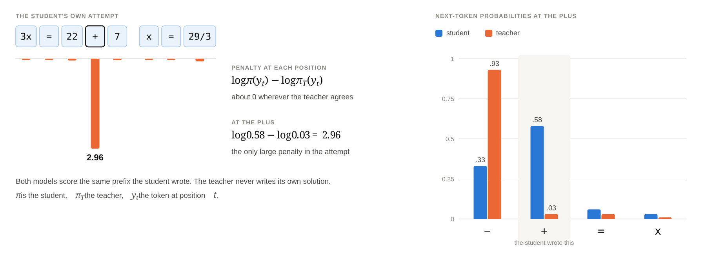</a>
</figure>

Averaged over the student's own attempts, that is the reverse KL from the student to the teacher. The intuition I use: how surprised would the teacher be by what the student actually wrote? Reverse KL is weighted by the student, so the student is only penalised for tokens it puts mass on. Forward KL is weighted by the teacher, so the student has to cover everything the teacher might say.

<figure class="diagram">
<a href="kl-directions.svg">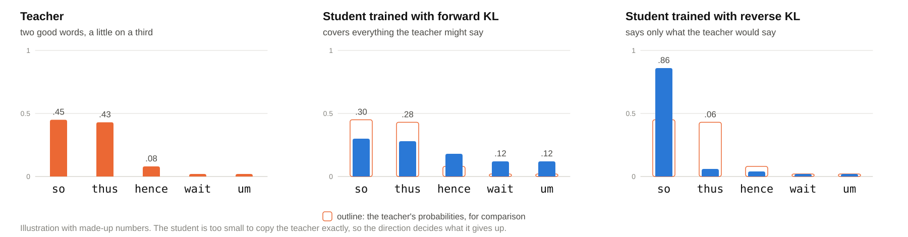</a>
</figure>

Picture a teacher that likes "so" and "thus" about equally, and a student too small to copy that mixture exactly. Forward KL pushes the student to spread out, and it occasionally says something odd. Reverse KL lets it settle on the teacher's favourite, less varied, rarely wrong. Which one wins depends on the task. The papers ahead pick differently, and OPSD in particular only worked in the forward direction.

The loop is short. The student writes from the question alone. The teacher scores every token and does not write anything itself. The student moves toward the teacher on those exact tokens. Repeat. The idea is DAgger from robotics: a driving policy copied from a human works until it drifts off-centre, into a situation the recordings never show, so you let the learner drive and have the expert correct it wherever it actually ends up. [Agarwal et al.](https://arxiv.org/abs/2306.13649) brought that to language models in 2023. More of the student's own text was always better, and the best divergence depended on the task. The teacher only reads, so the extra cost is one forward pass over text that already exists.

<figure class="diagram">
<a href="opd-loop.svg">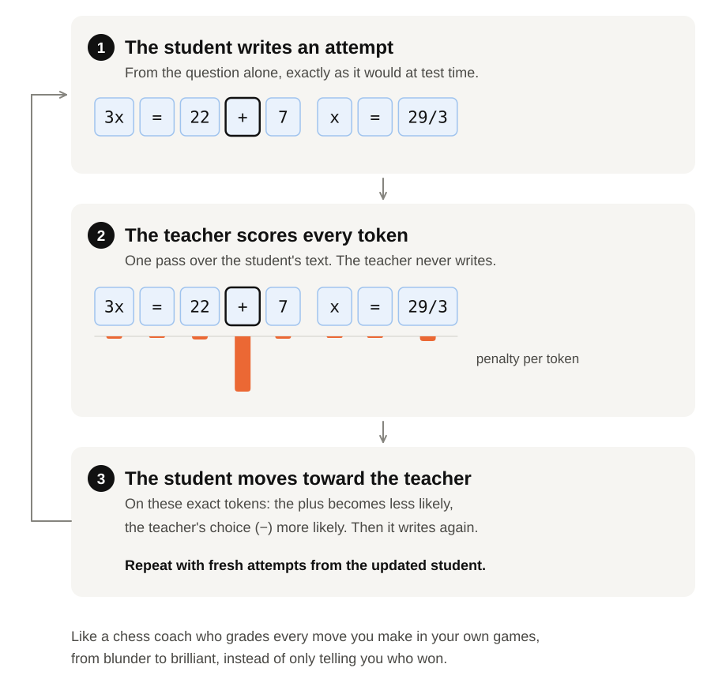</a>
</figure>

Three data points are why the labs merged specialists this way. The 2023 paper got about twice the improvement of ordinary distillation on summaries, translation, and grade-school maths. Qwen3, from the same 8B checkpoint, reached 67.6 on AIME with RL using nearly 18,000 GPU hours, and 74.4 with on-policy distillation using 1,800. Better, at about a tenth of the compute. Thinking Machines took an 8B from 60 to 70 on AIME in about 150 steps, which would have taken on the order of 2 million copied examples, and the same loop repaired forgetting after a fine-tune on internal documents.

Plugging it into RL is the one-line change they advertise. Keep the update. Swap the advantage. Each token gets teacher log-prob minus student log-prob, including on failed attempts, which is exactly where an all-fail GRPO group gives you a zero advantage and a wasted batch. The fuller version compares the whole next-token distribution, so tokens the student did not emit still get a target. That won in both later tests I care about here: 84.1 versus 82.1 on maths in OPSD, and 100 candidates beating 1 on code in SDPO. DeepSeek-V4 chose the distribution version because the one-token version was unstable.

## If there is no bigger teacher

All of that needs a teacher better than the student. If you are training the best model you have, there isn't one. The next move is to make the model its own teacher by giving that teacher something the student will not see at test time. One version puts a worked solution in the teacher's prompt. The other puts the environment's error text there. Same weights. Two prompts. If the extra text does not change the next-token distribution, the advantage is ~0 and there is nothing to learn. That is the 2020 theory showing up again, with the "different features" coming from context.

<figure class="diagram">
<a href="grade-three.svg">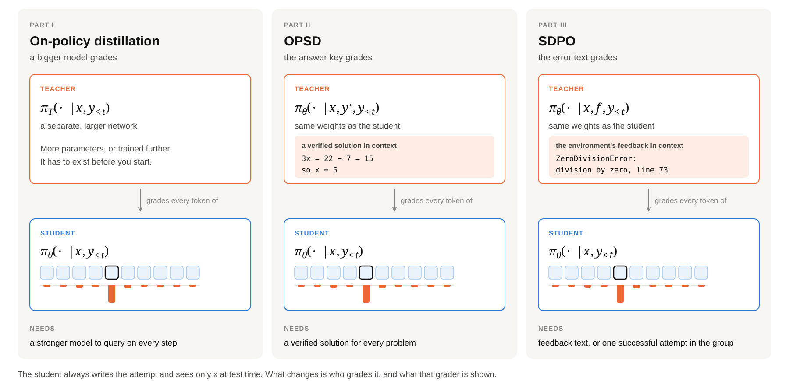</a>
</figure>

## OPSD: the answer key is reading material

[OPSD](https://arxiv.org/abs/2601.18734) (Self-Distilled Reasoner) is the answer-key version. Maths datasets come with a worked solution, and checking an answer is easier than finding one. The student sees only the problem and writes an attempt. The teacher's prompt adds a reference solution and tells the model to solve it in its own way, then the student's tokens are fed in. One forward pass grades every token, including after a mistake. The teacher is a frozen copy of the starting model. It never writes the training sequence.

Training on the solution itself is copying again. Here the solution is only the teacher's reading material.

On competition maths (AIME 2024, AIME 2025, HMMT 2025), the 1.7B model goes from 37.1 to 43.4 while RL barely moves, 37.7. Copying the solutions made every size worse: 61.8 to 59.8 at 8B, 61.2 to 58.6 at 4B, 37.1 to 35.8 at 1.7B. At 4B and 8B, OPSD is roughly level with RL, 63.6 versus 62.7 and 64.8 versus 64.0. The cost is the part I stare at. OPSD uses one attempt of at most 1,024 tokens per problem, for 100 steps. The RL baseline uses eight attempts of up to 16,000 tokens, for up to 500 steps. That is over a hundred times the tokens, and more than half of RL's groups were all right or all wrong, so the advantage was zero anyway. 4,096-token attempts did no better than 1,024. The answers branch early.

Three lessons from that paper stick. Forward KL was the only direction that clearly helped, 36.7 to 43.9 on AIME 2025 at 1.7B. With a thinking-mode teacher and a plain student, the biggest disagreements were on style words like "wait", "so", and "maybe", about six times larger than on maths words, and they had to cap each word's contribution or accuracy collapsed. And the price of the method is a verified solution for every problem. A lot of environments do not have one.

## SDPO: the environment already wrote the diagnosis

Most environments hand you a diagnosis: an error message, a failing test, a reviewer's comment. They say the answer was wrong, and they say roughly why. Standard RL throws the sentence away and keeps a bit. "Please answer in Newton-seconds" becomes −1. [SDPO](https://arxiv.org/abs/2601.20802) (Reinforcement Learning via Self-Distillation) keeps the text. The paper calls that rich feedback.

<figure class="diagram">
<a href="sdpo-fig-rlrf_new_palatino.png">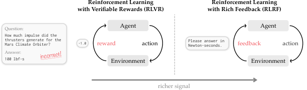</a>
</figure>

The same bug under four signals makes the difference obvious. A bit puts the same push on every token. A fractional reward is still one number, shared by the line. The error text can sit right there in the log, and a gradient still cannot read it, because the update multiplies by a number. SDPO puts that text in the teacher's context, and the grade lands on the plus.

<figure class="diagram">
<a href="setting-lanes.svg">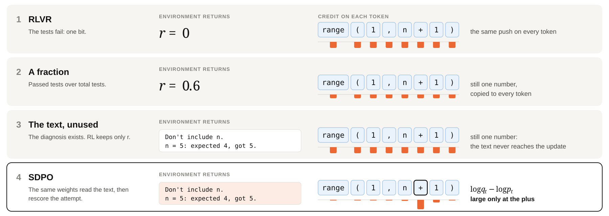</a>
</figure>

The self-teacher is the current model with a longer prompt: the question, a successful attempt from the same batch if one exists, the line "the following is feedback from your unsuccessful earlier attempt" followed by the error, and an instruction to solve the original question. Then the student's original answer is fed through unchanged. The student distribution `p` sees the question. The teacher distribution `q` is the same weights plus the feedback. The advantage of a candidate token is `log q − log p`.

Worked example from the paper. The question wants numbers from 1 to n, excluding n. The student puts 0.6 on the token that keeps the wrong bound, `range(1, n + 1)`. The teacher, having read "Don't include n", puts 0.1 on it. `log 0.1 − log 0.6` is about −1.8, so that token goes down. Where the feedback changes nothing, the advantage is about 0 and the loss leaves the token alone. Stop-gradient on `q` stops the teacher from cheating by simply agreeing with the student and ignoring the feedback. The paper shows this is a policy-gradient update, so it drops into a GRPO trainer by swapping the advantage.

<figure class="diagram">
<a href="three-steps.svg">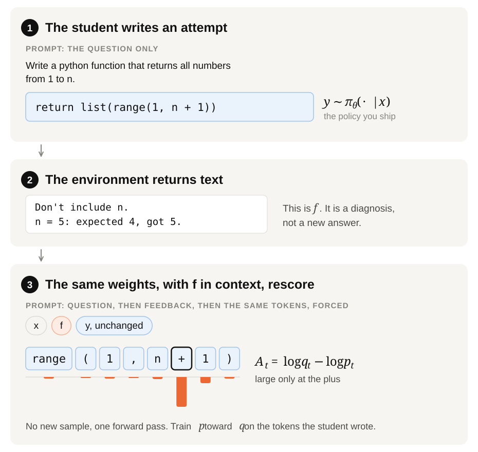</a>
</figure>

Two differences from OPSD matter in practice. Feedback exists even when nobody in the batch has solved the problem, because the environment still returned a message. And the teacher is not frozen. It follows the student slowly, so the thing doing the grading improves too, as long as you do not let it chase the student without an anchor.

The paper's own `range(1, n + 1)` example is the one I use when I have to explain credit assignment to someone who has only seen sequence-level rewards. The checker wanted n excluded. The self-teacher's disagreement sits on the plus and almost nowhere else. The model found its own mistake by rereading.

<figure class="diagram">
<a href="sdpo-fig-logratios.png">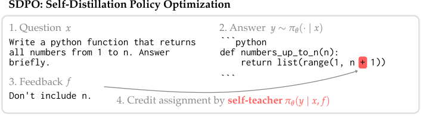</a>
</figure>

Under the token, the teacher still has a distribution. GRPO paints the whole line one colour, so `range` is marked the same as `+` even though `range` was the right function. SDPO grades the candidates: at the plus it wants to close the bracket, and one step later, stuck with a plus it can no longer rewrite, it prefers `0` or `)`, because it is being forced to continue the student's prefix and is trying to repair a call it cannot go back and edit. Matching the full distribution is a different update from simply down-weighting the sampled token.

<figure class="diagram">
<a href="sdpo-schematic-v5-grid-shorter.png">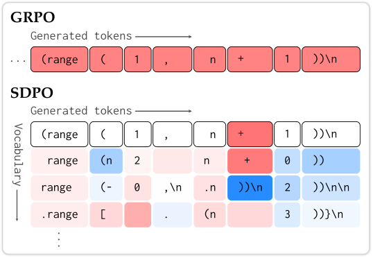</a>
</figure>

On a batch, the heatmap is the same story at scale. Each row is an attempt and each column is a token position, for Qwen3-8B. GRPO becomes horizontal stripes, one colour from the first token to the last, blue when that sample beat the group and red when it lost. A correct opening is painted with the mistake. SDPO is sparse. A near-white cell means the feedback did not change the next-token distribution there. The coloured specks are the positions where seeing the feedback actually changed the teacher's mind. GRPO cannot produce that pattern, because its advantage never consults the feedback text. The paper links that sparsity to much shorter answers, which makes sense once you notice the constant advantage was reinforcing the rambling along with the solution.

<figure class="diagram">
<a href="advantages.png">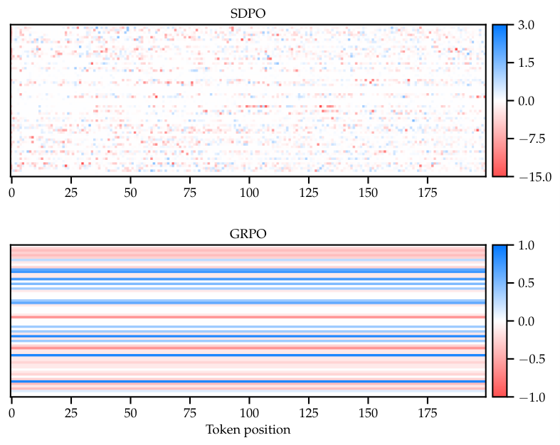</a>
</figure>

What you put in the teacher's prompt is an ablation, and the winner is a bit surprising if you think of the failed attempt as useful context. Error output alone gives 39.9. A successful sibling, another attempt at the same question from the same batch, gives 42.6. Both together give 48.3. The sibling acts like OPSD's answer key, except the model wrote it, and the error exists from the first failure. Add the student's own failed attempt as a hint and it gets worse. The teacher anchors on it, repeats the failure about three times as often, and the student explores less. The failed attempt is what gets graded. It should not also be the hint.

A lot of verifiable training has no error prose at all. Science questions and many tool calls return correct or incorrect. SDPO then uses a successful sample of the same question as the feedback for the failures, and the teacher is still forced along the failed tokens. Aggregate accuracy without rich feedback is 70.2% for SDPO against 66.6% for a strong GRPO, and average length drops by more than 3×. On Olmo3-7B chemistry the length drop is about 11×, and the accuracy GRPO reaches in about five hours shows up in about fifty minutes. One item after 50 steps is the qualitative version of that plot: GRPO writes 5,549 tokens, including "Wait I'm going in circles", and SDPO writes 764 and selects the right option. It does not win everywhere. It loses on biology with Qwen3-8B, 56.8 versus 59.9, and on one tool task. The method inherits whatever the model can do with a hint.

<figure class="diagram">
<a href="gen_results.svg">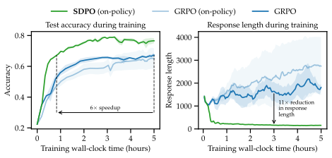</a>
</figure>

## Code, model size, and a teacher that has to move slowly

LiveCodeBench is the plot I would lead with if the room only had one figure, because the environment returns a message. The slice is 131 contest problems from February to May 2025, released after the model's training data. Public tests are the feedback during training. Private tests are the curve. Qwen3-8B: SDPO ends at 48.8%, GRPO at 41.2%, and SDPO reaches GRPO's final accuracy at about a quarter of the generations, which is the 4× claim. It also forgets less on a held-out average, 42.4 versus 41.8, with the base model at 43.5. On that same public-leaderboard slice, Claude Sonnet 4 sits at 40.5% and Opus 4 at 39.7%. That comparison is a leaderboard slice. The training recipes are not the same, and I would not quote it as one.

<figure class="diagram">
<a href="main.svg">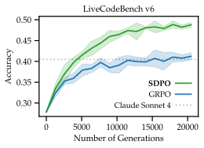</a>
</figure>

The self-teacher is only as good as the model's ability to use a hint, so the gap over GRPO grows from Qwen3-0.6B to 8B. They did not run 30B. Four points and a direction, not a scaling law. On Qwen2.5-1.5B, SDPO can lose to GRPO, because showing that model the traceback does not move the next-token distribution the right way. Mixing GRPO's scalar advantage back in helps at 0.6B, where the text signal is weak, and slightly hurts at 8B, where the scalar is the worse of the two signals. SDPO borrows the ability to use a hint. It does not create that ability.

<figure class="diagram">
<a href="model_scaling.svg">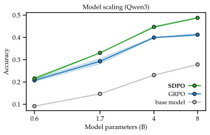</a>
</figure>

The credit-assignment ablation is why the loss is a distribution. Logit-level SDPO, over the top tokens, beats token-level SDPO, which beats collapsing the advantages into one sequence scalar, which still beats GRPO. The text helps even when you throw the density away. The density helps again. The teacher's own generative accuracy rises during training, and the student ends above the teacher's accuracy at step 0. That only holds if the teacher is regularised, by an exponential moving average or by mixing the initial weights back in at `α = 0.01`. Best score within 90 steps: a teacher that just tracks the student collapses to 36.1, a frozen teacher as in OPSD reaches 48.8, and a slowly following teacher reaches 49.3 to 50.6. An unregularised teacher drifts into a distribution that is no longer a good retrospective judge. Keeping the top 100 logits plus a tail is how they avoid storing two full vocabularies. That is an implementation detail. It is not the credit assignment.

<figure class="diagram">
<a href="teacher_bootstrap.svg">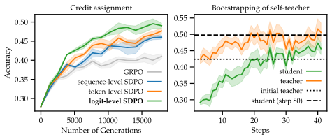</a>
</figure>

## Put the feedback in the weights

My favourite experiment in the SDPO paper is the test-time one. Take problems Qwen3-8B almost never solves. On the hard panel, pass@64 is below 0.03, so a GRPO group of ordinary size is all zeros and the advantage is zero until the first success, which may never arrive. Best-of-k spends attempts without updating the weights. Multi-turn keeps every error in the window, which is the card-game retry idea, and then hits the context limit after roughly 800 to 1,000 attempts. Test-time SDPO spends the same attempts as gradient steps on this one question and starts the next attempt from a fresh prompt.

<figure class="diagram">
<a href="TTT_pass_at_k_curves.svg">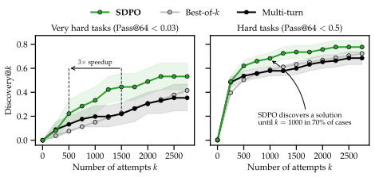</a>
</figure>

On the hardest nine, SDPO finds a solution in about 53% of runs against 42% and 36%, needs about three times fewer attempts, and solves one problem nothing else solves. On the hard panel it has a solution by `k = 1000` in about 70% of cases. Question 3 is solved only by SDPO, first at attempt 321, which is 20 updates at batch size 16. Reading the feedback once, with no weight update, almost never solves these. The progress is many small updates. The teacher seeing the hint a single time is not the effect.

<figure class="diagram">
<a href="sdpo-fig-ttt.png">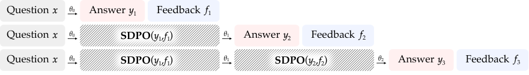</a>
</figure>

## One attempt, then the tokens go stale

Everything up to here still assumed a batch of attempts at the same question, because that is how GRPO estimates a mean and a spread. A user query does not arrive as eight i.i.d. rollouts. It arrives as one trajectory, and then an accept, an edit, a retry, or a reply. Manufacturing the missing rollouts in a simulator means you are training on an environment you do not deploy. The scaling note starts from that production shape. SDPO's target exists as soon as the signal is text. GRPO's advantage does not exist until there is a group to center.

<figure class="diagram">
<a href="setting.svg">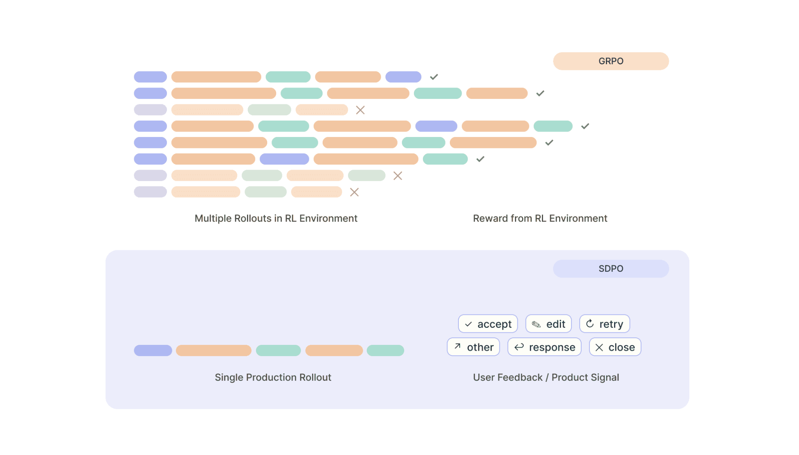</a>
</figure>

On τ-bench retail, an agent serving simulated shoppers through tools, one attempt per question with failures kept learns fastest. Throwing away failed groups is the slow one, still climbing past eight hours, because the failures were the signal.

<figure class="diagram">
<a href="tau-group.svg">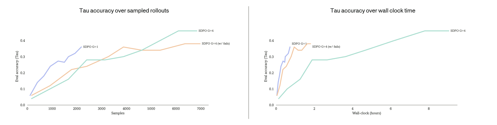</a>
</figure>

Agent tasks take seconds to an hour, and the trainer updates on whatever has finished. Call `K` the number of trainer steps between the policy that wrote the tokens and the policy that consumes them. A long trace from one user can land after several updates on shorter traces. Waiting for every in-flight rollout does not set `K` to 0, because whatever finished earlier has already moved the weights, and the trainer sits idle for the slowest user. The SDPO paper trains at `K = 0`. Any run long enough to need asynchronous rollouts, and any run on live traffic, has `K > 0` as the normal case. Kimi's partial rollouts are the same fact at frontier scale: a trajectory spans iterations. APEX trajectories can run for an hour. Short ones finish in seconds. Synchronous training pays that tail on every step.

<figure class="diagram">
<a href="async-flow.svg">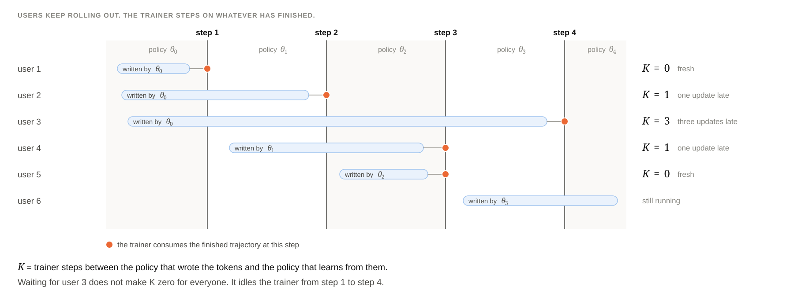</a>
</figure>

PPO's importance ratio corrects for that staleness on average. If the old model almost never wrote a token and wrote it anyway, one ratio hits 50 or 100. GRPO multiplies one advantage by that ratio and then averages across the trace, so a wild token is diluted by the tokens around it. SDPO has a separate KL at that position, so the wild ratio is the entire update there. On τ-bench retail, Qwen3-4B, `K = 3`, five seeds, with importance sampling and no clip: accuracy rises for about 15 steps and then falls, trajectory length collapses after step 20, and the tool error rate climbs from near 0 to about 0.5. The same correction that is harmless when the advantage is one number per trace is unstable when the advantage is already per token. That is a consequence of the credit assignment.

<figure class="diagram">
<a href="is-collapse.svg">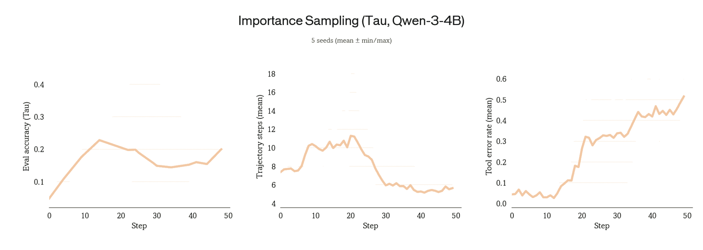</a>
</figure>

Three fixes, and only the third one I actually want to keep. Cap the ratio, PPO-style, around 0.2. It stops the crash, and the seeds disagree wildly. Add a pull toward a reference model. That steadies the run, costs an extra model pass, and anchors you to the start. Cap each token's advantage at 3× its running mean, on top of the ratio clip. Steady, and no reference model. The 3 is an ablation, not a derived constant. Once the advantage is per token, the ratio and the advantage each need their own bound, because either one can dominate the update. Both caps together is what the note calls SDPO++.

<figure class="diagram">
<a href="ppo-clip.svg">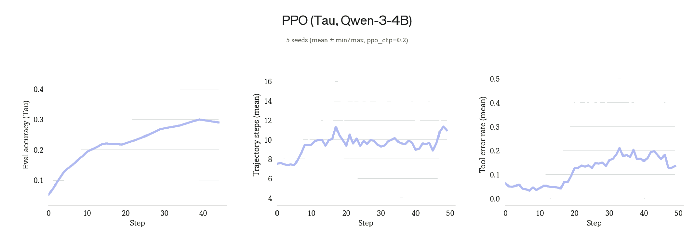</a>
</figure>

<figure class="diagram">
<a href="kl-penalty.svg">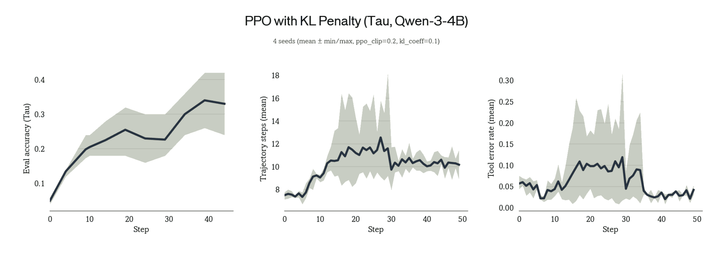</a>
</figure>

<figure class="diagram">
<a href="adv-clip.svg">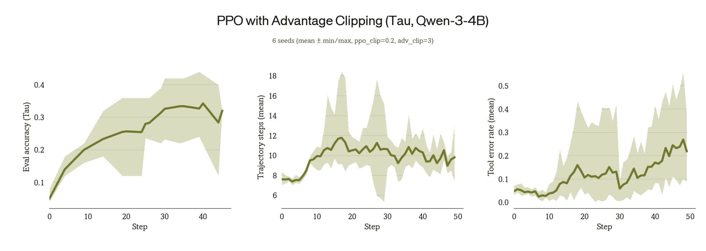</a>
</figure>

With both caps, data up to three updates stale ends about as well as fresh data, and ten updates stalls. So the operating point is three, which roughly doubles training speed, because you no longer wait out the tail. The same caps, untuned, moved to [APEX-Agents](https://www.mercor.com/blog/introducing-apex-agents/): long investment-banking, consulting, and law tasks graded against expert checklists, on GPT-OSS-120B, a model that almost never passes at the start. One attempt per task. Mean reward goes from about 5% before training, to 16% with SDPO, to 25% with both caps.

<figure class="diagram">
<a href="staleness.svg">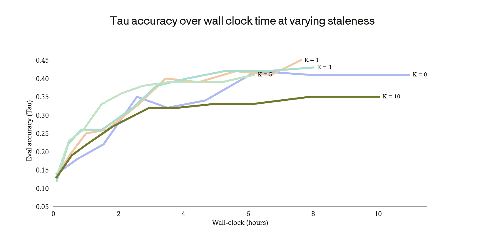</a>
</figure>

<figure class="diagram">
<a href="apex.svg">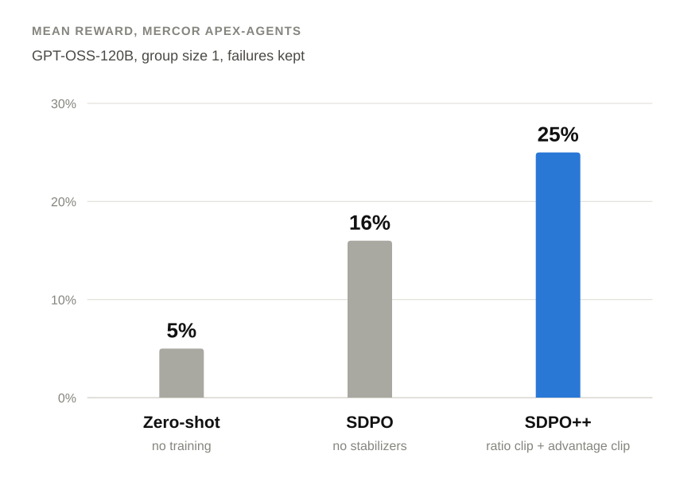</a>
</figure>

## Attention, and a critic you trust per problem

Two related papers sit next to this, and I keep them because they break in instructive ways.

[OPASD](https://arxiv.org/abs/2609.33200) goes back to OPSD's setting and also copies where the teacher was looking. When a model picks a token it also puts a distribution over earlier positions. That is attention. OPSD copies the teacher's word. OPASD adds a term that matches the teacher's attention, with a 0.5 weight in the paper's loss. The catch is that part of the teacher's attention lands on the solution in its prompt, which the student does not have. The fix keeps only positions the student can see, the problem and its own work, and rescales those weights to sum to 1. The relative pattern stays, and it is still the view of a teacher who has read the solution.

On the average of AIME 2024–2026 and HMMT 2025, OPASD wins at every size they report: Qwen3-8B from 47.6 to 49.5 with OPSD and 55.4 with OPASD, 4B from 46.8 to 42.4 and 50.8, 1.7B from 28.8 to 29.0 and 34.0. On 1.7B, attention alone (31.0) already beats words alone (29.0), and both together reach 34.0. The row I care about is 4B over a longer run. Plain OPSD, which the original paper stopped around 100 steps, ends below its start by 200 steps. Answers balloon from about 1,100 to 6,100 tokens, and "wait" shows up 7.4 times per 1,000 tokens versus 3.6 with OPASD, which stays around 1,000–1,600 tokens, uses about a quarter of the tokens, and trains about 1.53× faster. The reading I take, which neither paper states as such: OPSD's thinking-mode teacher disagreed most on style words, so a per-token teacher can teach style. SDPO, with thinking off, made answers shorter. If you run self-distillation, watch answer length. It is the canary.

[AC2](https://arxiv.org/abs/2609.39247) is for the case with no feedback text at all. An olympiad proof can be 50,000 tokens and is graded only at the end, so GRPO finishes every proof and gives every token the same credit. A critic predicts the eventual verifier score from a prefix, and the advantage of a chunk is how much that prediction moved. Language-model RL mostly refused to trust that, even in papers that train a value model and then use it only as a baseline. Critics on long chain-of-thought were considered too inaccurate to use alone.

<figure class="diagram">
<a href="ac2.svg">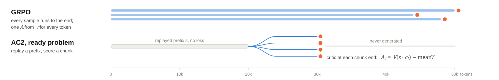</a>
</figure>

AC2's twist is to trust the critic only where it has earned it, problem by problem. Cut a past attempt at a random point and write 16 continuations of about 10,000 tokens. If the critic is trusted on this problem, score them with it and stop. If not, finish them and use real scores, which also train the critic. Trust here means low recent error, low last error on this problem, and solved at least once. The critic is the model itself, asked to estimate how much rubric credit the attempt will earn, with a correct earlier proof in its prompt. Same trick again: the model, plus context the student will not have at test time.

On Qwen3-4B, about 5,200 proof problems, tested on IMO-ProofBench (60 problems, a 0–7 rubric), GRPO peaks at 18.5% after 120 steps. AC2 passes that score at step 90 with about 2.5× less generation and peaks at 20.6%. Trust the critic everywhere and the score falls. 2,000-token chunks peak and then drop. Averaging the critic over 16 continuations is off by about 0.07, against 0.21 for one guess. The critic is usable once you have measured it on the problem in front of you.

## One model, two prompts

Read the methods by what they consume.

| method | who writes | who grades | what the grader knows |
| --- | --- | --- | --- |
| copying (SFT) | an expert or a bigger model | nobody, you imitate the tokens | nothing extra |
| GRPO | the student | a checker | the outcome, as one number |
| on-policy distillation | the student | a separate, better model | that model's own knowledge |
| OPSD, OPASD | the student | the same model, frozen | a worked solution in the prompt, and for OPASD the attention pattern on positions the student can see |
| SDPO | the student | the same model, moving slowly | the error text, or a sibling's success |
| AC2 | the student, in ~10k-token chunks | the same model, as a critic | a correct earlier proof, and a score you only trust per problem |

Three things I actually believe after drawing all of this.

The teacher is a prompt. OPSD, SDPO, and AC2's critic all show the model being trained something it will not have at test time. If that extra text does not change the next-token distribution, the advantage is ~0.

Full probabilities beat one number, until you genuinely do not have text. Soft labels, OPSD, SDPO's top-100 logits, and DeepSeek-V4's choice of the distribution-valued update all point the same way. AC2 keeps one number and moves it from the end of a 50,000-token proof to the end of a 10,000-token chunk.

GRPO stays the chassis. Every method here keeps the RL update and changes what the advantage is made of. Your own text also forgets less. The card-game study, DeepMind's on-policy comparisons, and SDPO's forgetting numbers all agree on that, for different reasons that happen to stack.

Which one you run depends on what the environment already gives you. I find it easier to think about a coding agent than about a benchmark table.

A user asks it to fix a failing test. It writes a patch and CI says `AssertionError: expected 4, got 5`. That text is feedback. Run SDPO with the CI log in the teacher's prompt, so the grade can land on the line that caused it. One attempt per request is enough, and the user's later edit of the patch is feedback too. If you are training asynchronously, which you will be once traces take more than a few seconds, cap the importance ratio and cap the per-token advantage. SDPO++ in the note is ratio clip 0.2 and advantage clip 3.

Some tickets have the patch a senior engineer merged. That is a verified solution. Use it as OPSD's teacher context, so the model learns from its own attempt, graded by itself with the merged patch in view. If you are in thinking mode, watch the length. A per-token teacher will happily teach "wait".

Big refactors that are only scored at the end, by a rubric, with no explanation, are the AC2 setting, once the critic has earned trust on that kind of task. Until then you still finish the rollout and use the real score.

A bigger internal model, or specialists you already trained for different languages, is ordinary on-policy distillation. That is also how DeepSeek and Kimi merge the domain experts after the GRPO stage.

Tickets you can retry several times, with mixed pass and fail inside a group, still get GRPO. The test suite stays the final judge. It stops being the only thing the model learns from.

The failure modes are symmetric with the method. Wrong or vague feedback gets distilled faithfully, because the teacher believes the text you put in the prompt. A model that cannot use a hint makes a useless self-teacher, which is the 1.5B result. A teacher that simply tracks the student falls apart, which is the 36.1. A per-token teacher can teach style as easily as substance, which is the 4B length blow-up. A critic trusted too early is why critics went out of fashion. The evidence here is code, proofs, a retail agent, and a professional-task benchmark. It is a lot, and it is not everything.

The through-line I keep is small. The model already writes one token at a time. The grade should be allowed to be one token at a time too. GRPO is what you do when the only thing you trust is a checker and a group. The moment the environment, the user, or a solution writes a sentence, that sentence can be a second prompt on the same weights, and the advantage can finally sit on the plus.
